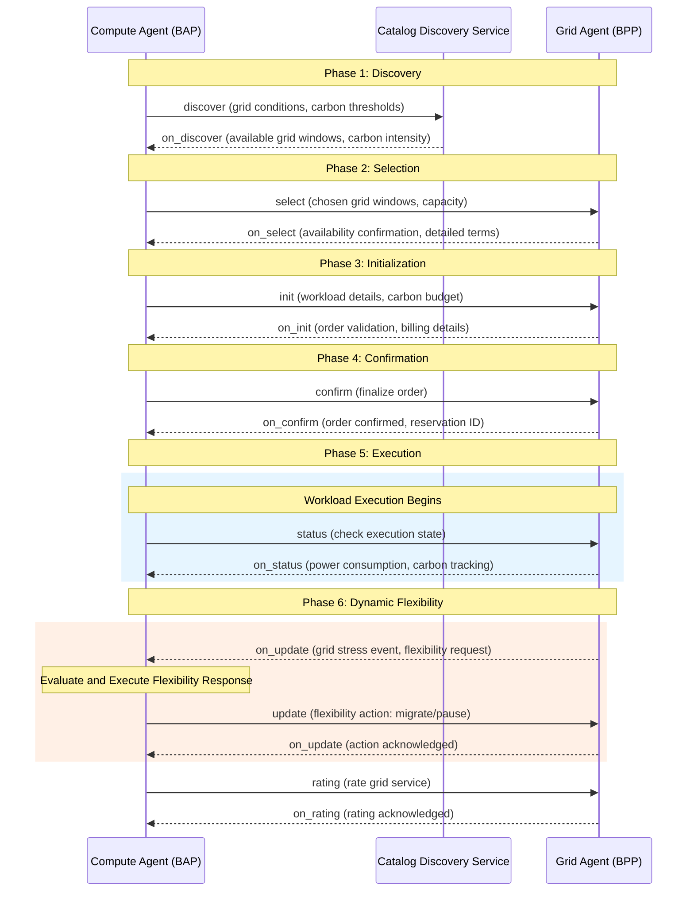

# Compute-Energy Convergence - Version 0.1 (DRAFT)

## Table of Contents

- [Compute-Energy Convergence - Version 0.1 (DRAFT)](#compute-energy-convergence---version-01-draft)
  - [Table of Contents](#table-of-contents)
  - [1. Copyright Notice](#1-copyright-notice)
  - [2. Status of This Memo](#2-status-of-this-memo)
  - [3. Abstract](#3-abstract)
  - [4. Introduction](#4-introduction)
    - [4.1 Purpose](#41-purpose)
  - [5. Scope](#5-scope)
  - [6. Intended Audience](#6-intended-audience)
  - [7. Prerequisites](#7-prerequisites)
  - [8. Conventions and Terminology](#8-conventions-and-terminology)
  - [9. Background and Context](#9-background-and-context)
    - [9.1 Problem Domain](#91-problem-domain)
    - [9.2 Current State](#92-current-state)
    - [9.3 Motivation](#93-motivation)
  - [10. Creating an Open Network for Compute-Energy Convergence](#10-creating-an-open-network-for-compute-energy-convergence)
    - [10.1 Setting up a Registry](#101-setting-up-a-registry)
      - [10.1.1 For a Network Participant](#1011-for-a-network-participant)
        - [10.1.1.1 Step 1: Claiming a Namespace](#10111-step-1-claiming-a-namespace)
        - [10.1.1.2 Step 2: Setting up a Registry](#10112-step-2-setting-up-a-registry)
        - [10.1.1.3 Step 3: Publishing subscriber details](#10113-step-3-publishing-subscriber-details)
      - [10.1.2 Step 4: Share details with Beckn One team](#1012-step-4-share-details-with-beckn-one-team)
      - [10.1.3 For a Network facilitator organization](#1013-for-a-network-facilitator-organization)
        - [10.1.3.1 Step 1: Claiming a Namespace](#10131-step-1-claiming-a-namespace)
        - [10.1.3.2 Step 2: Setting up a Registry](#10132-step-2-setting-up-a-registry)
        - [10.1.3.3 Step 3: Publishing subscriber details](#10133-step-3-publishing-subscriber-details)
        - [10.1.3.4 Step 4: Share details with Beckn One team](#10134-step-4-share-details-with-beckn-one-team)
    - [10.2 Setting up the Protocol Endpoints](#102-setting-up-the-protocol-endpoints)
      - [10.2.1 Installing Beckn ONIX](#1021-installing-beckn-onix)
      - [10.2.2 Configuring Beckn ONIX for Compute-Energy](#1022-configuring-beckn-onix-for-compute-energy)
      - [10.2.3 Performing a test transaction](#1023-performing-a-test-transaction)
  - [11. Implementing Compute Energy semantics with Beckn Protocol](#11-implementing-compute-energy-semantics-with-beckn-protocol)
    - [11.1 Overview](#111-overview)
    - [11.2 Step-by-Step Implementation](#112-step-by-step-implementation)
      - [11.2.1 Step 1: Grid Window Discovery](#1121-step-1-grid-window-discovery)
      - [11.2.2 Step 2: Workload Selection](#1122-step-2-workload-selection)
      - [11.2.3 Step 3: Order Initialization](#1123-step-3-order-initialization)
      - [11.2.4 Step 4: Order Confirmation](#1124-step-4-order-confirmation)
      - [11.2.5 Step 5: Workload Execution](#1125-step-5-workload-execution)
      - [11.2.6 Step 6: Dynamic Flexibility Response](#1126-step-6-dynamic-flexibility-response)
    - [11.3 Testing](#113-testing)
      - [11.3.1 Test Scenarios](#1131-test-scenarios)
      - [11.3.2 Validation Checklist](#1132-validation-checklist)
  - [12. Best Practices](#12-best-practices)
    - [12.1 Design Principles](#121-design-principles)
    - [12.2 Common Patterns](#122-common-patterns)
      - [12.2.1 Pattern 1: Multi-Region Workload Distribution](#1221-pattern-1-multi-region-workload-distribution)
      - [12.2.2 Pattern 2: Dynamic Workload Migration](#1222-pattern-2-dynamic-workload-migration)
    - [12.3 Anti-Patterns](#123-anti-patterns)
      - [12.3.1 Anti-Pattern 1: Ignoring Carbon Intensity Signals](#1231-anti-pattern-1-ignoring-carbon-intensity-signals)
      - [12.3.2 Anti-Pattern 2: Over-Committing Compute Resources](#1232-anti-pattern-2-over-committing-compute-resources)
    - [12.4 Performance Considerations](#124-performance-considerations)
    - [12.5 Language and Conventions](#125-language-and-conventions)
      - [12.5.1 Naming Conventions](#1251-naming-conventions)
      - [12.5.2 Data Validation Rules](#1252-data-validation-rules)
      - [12.5.3 Error Handling Standards](#1253-error-handling-standards)
    - [12.6 Security Considerations](#126-security-considerations)
  - [13. IANA Considerations](#13-iana-considerations)
  - [14. Examples](#14-examples)
    - [14.1 Discovery Examples](#141-discovery-examples)
      - [14.1.1 Grid Window Discovery (discover API)](#1411-grid-window-discovery-discover-api)
      - [14.1.2 Available Grid Windows (on\_discover API)](#1412-available-grid-windows-on_discover-api)
    - [14.2 Order Examples](#142-order-examples)
      - [14.2.1 Workload Selection (select API)](#1421-workload-selection-select-api)
      - [14.2.2 Selection Confirmation (on\_select API)](#1422-selection-confirmation-on_select-api)
      - [14.2.3 Order Initialization (init API)](#1423-order-initialization-init-api)
      - [14.2.4 Initialization Response (on\_init API)](#1424-initialization-response-on_init-api)
      - [14.2.5 Order Confirmation (confirm API)](#1425-order-confirmation-confirm-api)
      - [14.2.6 Confirmation Acknowledgement (on\_confirm API)](#1426-confirmation-acknowledgement-on_confirm-api)
    - [14.3 Fulfillment Examples](#143-fulfillment-examples)
      - [14.3.1 Workload Shift Request (update API)](#1431-workload-shift-request-update-api)
      - [14.3.2 Workload Shift Notification (on\_update API)](#1432-workload-shift-notification-on_update-api)
      - [14.3.3 Continue with Alert Request (update API)](#1433-continue-with-alert-request-update-api)
      - [14.3.4 Carbon Intensity Spike Alert (on\_update API)](#1434-carbon-intensity-spike-alert-on_update-api)
      - [14.3.5 Status Request (status API)](#1435-status-request-status-api)
      - [14.3.6 Status Response (on\_status API)](#1436-status-response-on_status-api)
    - [14.4 Post-Fulfillment Examples](#144-post-fulfillment-examples)
      - [14.4.1 Rating Request (rating API)](#1441-rating-request-rating-api)
      - [14.4.2 Rating Response (on\_rating API)](#1442-rating-response-on_rating-api)
      - [14.4.3 Support Request (support API)](#1443-support-request-support-api)
      - [14.4.4 Support Response (on\_support API)](#1444-support-response-on_support-api)
    - [14.5 Future Reference Implementations](#145-future-reference-implementations)
  - [15. References](#15-references)
    - [15.1 Normative References](#151-normative-references)
    - [15.2 Informative References](#152-informative-references)
  - [16. Appendix](#16-appendix)
    - [16.1 Change Log](#161-change-log)
    - [16.2 Acknowledgments](#162-acknowledgments)
    - [16.3 Glossary](#163-glossary)
    - [16.4 FAQ](#164-faq)
    - [16.5 RFC Evolution and Maintenance](#165-rfc-evolution-and-maintenance)
      - [16.5.1 Version Management](#1651-version-management)
      - [16.5.2 Community Contribution Guidelines](#1652-community-contribution-guidelines)
      - [16.5.3 Maintenance Procedures](#1653-maintenance-procedures)
      - [16.5.4 Deprecation and Migration Policy](#1654-deprecation-and-migration-policy)
    - [16.6 Troubleshooting](#166-troubleshooting)
      - [16.6.1 Issue 1: Workload Migration Failures](#1661-issue-1-workload-migration-failures)
      - [16.6.2 Issue 2: Carbon Intensity Data Discrepancies](#1662-issue-2-carbon-intensity-data-discrepancies)
      - [16.6.3 Issue 3: Grid Capacity Conflicts](#1663-issue-3-grid-capacity-conflicts)
      - [16.6.4 Issue 4: Real-Time Coordination Delays](#1664-issue-4-real-time-coordination-delays)

---

## 1. Copyright Notice

This work is licensed under Creative Commons Attribution-ShareAlike 4.0 International License

## 2. Status of This Memo

This document is a draft RFC for implementation guidance on using Beckn Protocol for Compute-Energy Convergence. It provides comprehensive guidance for data center operators, cloud providers, and grid operators implementing intelligent workload scheduling aligned with grid flexibility and carbon intensity signals. The specification is ready for community review and pilot implementations.

## 3. Abstract

This RFC presents a transformative approach to data center operations by leveraging the Beckn Protocol's distributed commerce architecture for **Compute-Energy Convergence**. Rather than treating compute workloads and energy consumption as separate concerns, this approach creates an **intelligent coordination layer** where AI training jobs, batch processing, and other flexible compute workloads are dynamically scheduled based on real-time grid conditions, renewable energy availability, and carbon intensity signals.

The architecture enables data centers to become **active grid participants** rather than passive energy consumers, optimizing workload placement across geographic regions to minimize carbon footprint and energy costs while maintaining service quality. Through agentic coordination between Compute Agents (managing workload scheduling) and Grid Agents (providing real-time grid intelligence), this marketplace-driven approach addresses the growing energy demands of AI and cloud computing through carbon-aware, cost-optimized, and grid-friendly compute scheduling.

This implementation transforms data centers from being grid stress contributors to becoming grid stability enablers, creating economic value from temporal and spatial flexibility in compute workload execution.

---

## 4. Introduction

### 4.1 Purpose

This RFC provides implementation guidance for deploying Compute-Energy Convergence systems using the Beckn Protocol. It specifically addresses how data center operators and cloud providers can implement intelligent workload scheduling that aligns compute execution with grid flexibility, renewable energy availability, and carbon intensity signals while achieving cost optimization and carbon reduction goals.

## 5. Scope

This document covers:
- Architecture patterns for compute-energy convergence using Beckn Protocol
- Discovery mechanisms for grid flexibility windows and carbon intensity signals
- Workload scheduling and ordering mechanisms aligned with grid conditions
- Dynamic workload migration in response to real-time grid events
- Carbon accounting for compute workloads
- Integration with data center orchestration and grid monitoring systems

This document does not cover:
- Detailed data center infrastructure specifications
- Specific AI/ML framework implementations
- Hardware specifications for compute clusters
- Regulatory compliance beyond technical implementation

## 6. Intended Audience

- **Data Center Operators**: Managing energy-intensive compute facilities and seeking carbon reduction
- **Cloud Service Providers**: Offering carbon-aware compute services to customers
- **AI/ML Platform Operators**: Running large-scale training and inference workloads
- **Grid Operators**: Providing flexibility signals and carbon intensity data
- **Energy Managers**: Optimizing data center energy consumption and costs
- **Sustainability Officers**: Tracking and reducing carbon footprint of compute operations
- **Technology Integrators**: Building Beckn-based compute-energy solutions
- **Policymakers**: Understanding technical implementation for green computing initiatives

## 7. Prerequisites

Readers should have:
- **Basic understanding of Beckn Protocol concepts and APIs**
  - [Beckn Protocol Specification v2.0.0](https://github.com/beckn/protocol-specifications)
  - [Beckn Protocol Developer Documentation](https://developers.becknprotocol.io/)
  - [Generic Implementation Guide](https://github.com/beckn/missions/blob/main/Generic-Implementation-Guide/generic_implementation_guide.md)
- **Knowledge of data center operations and workload orchestration**
  - Container orchestration (Kubernetes, Docker Swarm)
  - Workload scheduling and resource management
  - Data center energy management systems
- **Understanding of electricity grids and carbon intensity**
  - Grid frequency and stability concepts
  - Renewable energy intermittency
  - Carbon intensity measurement and reporting
- **Familiarity with JSON-LD, JSON schema and RESTful APIs**
  - [JSON-LD Specification](https://json-ld.org/)
  - [JSON Schema Specification](https://json-schema.org/)
  - [RESTful API Design Guidelines](https://restfulapi.net/)

## 8. Conventions and Terminology

**MUST**, **MUST NOT**, **REQUIRED**, **SHALL**, **SHALL NOT**, **SHOULD**, **SHOULD NOT**, **RECOMMENDED**, **MAY**, and **OPTIONAL** in this document are to be interpreted as described in RFC 2119.

**Additional Terms:**
- **Compute Agent**: Intelligent agent managing workload scheduling and compute resource allocation
- **Grid Agent**: Agent providing real-time grid conditions, carbon intensity, and flexibility signals
- **Grid Window**: Time period with specific grid characteristics (renewable mix, carbon intensity, pricing)
- **Workload Flexibility**: Ability to shift compute workload execution in time or location
- **Carbon Budget**: Maximum allowable carbon emissions for a compute workload
- **Temporal Flexibility**: Time range within which a workload can be executed
- **Spatial Flexibility**: Geographic regions where a workload can be executed
- **BAP**: Beckn Application Platform (Compute Agent in this context)
- **BPP**: Beckn Provider Platform (Grid Agent in this context)

## 9. Background and Context

### 9.1 Problem Domain

**The AI Energy Crisis**

Modern AI and cloud computing face an unprecedented energy challenge that threatens both environmental sustainability and operational economics:

**Explosive Energy Demand**: AI training workloads consume massive amounts of electricity. Training a single large language model can consume as much energy as 100 US homes use in a year. Global data center electricity consumption is projected to double by 2026, reaching 1,000 TWh annually—equivalent to Japan's total electricity consumption.

**Carbon Footprint Impact**: Data centers currently account for 1-2% of global electricity use and associated carbon emissions. As AI workloads grow exponentially, this percentage is rising rapidly. A single AI training run can emit as much CO₂ as five cars over their entire lifetimes.

**Grid Stress from Compute**: Large-scale AI training creates sustained multi-megawatt loads that strain local grids. Unlike traditional IT workloads with variable demand patterns, AI training represents continuous baseload that can overwhelm grid capacity during peak hours.

**The Renewable Intermittency Challenge**

Data centers seeking to reduce carbon footprint face a fundamental mismatch:

**Time Misalignment**: Solar energy peaks at midday, but data center cooling loads peak in the afternoon. Wind energy is often strongest at night when compute demand may be lower. This temporal mismatch means data centers often consume grid power when renewable availability is low.

**Location Constraints**: The best renewable energy resources (wind in Scotland, solar in Spain) are often far from major data center hubs. Traditional data center operations cannot leverage this spatial distribution of clean energy.

**Economic Inefficiency**: Data centers pay peak electricity prices during high-demand periods, even when cheaper renewable energy is abundant elsewhere. This economic inefficiency compounds the environmental impact.

**The Hidden Flexibility Opportunity**

Not all compute workloads require immediate execution:

**AI Training Flexibility**: Model training jobs that take hours or days can often be scheduled flexibly within a broader time window. A training job that takes 12 hours can potentially start anytime within a 24-48 hour window.

**Batch Processing**: Data analytics, rendering, simulation, and other batch workloads have inherent temporal flexibility—they need to complete by a deadline but don't require instant execution.

**Geographic Distribution**: Cloud providers with multi-region infrastructure can shift workloads between data centers, but currently lack the intelligence to do so based on grid conditions and carbon intensity.

**Workload Preemption**: Some workloads support checkpointing—they can be paused, migrated, and resumed elsewhere, enabling dynamic response to grid conditions.

### 9.2 Current State

Traditional data center operations face limitations:

**Static Scheduling**: Workloads scheduled based on resource availability without considering energy source or carbon impact
**Location Lock-in**: Jobs execute in predetermined data centers regardless of grid conditions elsewhere
**Manual Coordination**: Energy managers manually review forecasts and adjust operations
**Limited Visibility**: Lack of real-time grid condition and carbon intensity data
**Economic Suboptimization**: Missing opportunities for cost savings through temporal and spatial flexibility

### 9.3 Motivation

Using Beckn Protocol for Compute-Energy Convergence enables:

**Carbon-Aware Scheduling**: Automatically align workload execution with high renewable energy availability
**Cost Optimization**: Leverage temporal and spatial flexibility to minimize energy costs
**Grid Participation**: Data centers become active grid participants, providing flexibility during stress events
**Transparent Accounting**: Clear tracking of carbon emissions and energy costs per workload
**Automated Coordination**: Real-time agentic coordination between compute and grid systems
**Multi-Region Optimization**: Intelligent workload distribution across geographic regions

## 10. Creating an Open Network for Compute-Energy Convergence

To create an open network for Compute-Energy Convergence requires all Compute Agents (BAPs) and Grid Agents (BPPs) to be able to discover each other and become part of a common ecosystem. This ecosystem is manifested in the form of a Registry maintained by a Network Facilitator Organization (NFO).

### 10.1 Setting up a Registry

The NP Registry serves as the root of addressability and trust for all network participants. It maintains comprehensive details such as the participant's globally unique identifier (ID), network address (Beckn API URL), public key, operational domains, and assigned role (e.g., BAP, BPP). In addition to managing participant registration, authentication, authorization, and permission control, the Registry oversees participant verification, activation, and overall lifecycle management, ensuring that only validated and authorized entities can operate within the network.

You can publish your registries at [DeDi.global](https://publish.dedi.global/).

#### 10.1.1 For a Network Participant

##### 10.1.1.1 Step 1: Claiming a Namespace

To get started, any platform that has implemented Beckn Protocol MUST create a globally unique namespace for themselves.
All NPs (BAPs, BPPs) **MUST** register as a user on dedi.global and claim a unique namespace against their FQDN to become globally addressable. As part of the claiming process, the user must prove ownership of the namespace by verifying the ownership of their domain. Namespace would be at an organisation level. You can put your organisation name as the name of the namespace.

##### 10.1.1.2 Step 2: Setting up a Registry

Once the namespace is claimed, each NP **MUST** create a Beckn NP registry in the namespace to list their subscriber details. While creating the registry, the user **MUST** configure it with the [subscriber schema](https://gist.githubusercontent.com/nirmalnr/a6e5b17522169ecea4f3ccdd831af7e4/raw/7744f2542034db9675901b61b41c8228ea239074/beckn-subscriber-no-refs.schema.json). Example of a registry name can be `subscription-details`.

##### 10.1.1.3 Step 3: Publishing subscriber details

In the registry that is created, NPs **MUST** publish their subscription details including their ID, network endpoints, public keys, operational domains and assigned roles (BAP, BPP) as records.

*Detailed steps to create namespaces and registries in dedi.global can be found [here](https://github.com/dedi-global/docs/blob/0976607aabc6641d330a3d41a3bd89ab8790ea09/user-guides/namespace%20and%20registry%20creation.md).*

#### 10.1.2 Step 4: Share details with Beckn One team

Once the registry is created and details are published, the namespace and the registry name of the newly created registry should be shared with the beckn one team.

#### 10.1.3 For a Network facilitator organization

##### 10.1.3.1 Step 1: Claiming a Namespace

An NFO **MAY** register as a user on dedi.global and claim a unique namespace against their FQDN. As part of the claiming process, the user must prove ownership of that namespace by verifying the ownership of that domain. The NFO name can be set as the name of the namespace.
*Note: A calibrated roll out of this infrastructure is planned and hence before it is open to the general public NFOs are advised to share their own domain and the domains of their NPs to the Beckn One team so that they can be whitelisted which will allow the NPs to verify the same using TXT records in their DNS.*

##### 10.1.3.2 Step 2: Setting up a Registry

Network facilitators **MAY** create registries under their own namespace using the [subscriber reference schema](https://gist.githubusercontent.com/nirmalnr/a6e5b17522169ecea4f3ccdd831af7e4/raw/b7cf8a47e6531ef22744b43e6305b8d8cc106e7b/beckn-subscriber-reference.schema.json) to point to either whole registries or records created by the NPs in their own namespaces. Example of a registry name can be `subscription-details`.

##### 10.1.3.3 Step 3: Publishing subscriber details

In the registry that is created, NFOs **MAY** publish records which act as pointers to either whole registries or records created by the NPs records. The URL field in the record would be the lookup URL for a registry or a record as per DeDi protocol.

Example: For referencing another registry created by an NP, the record details created would be:

```json
{
  "url": "https://.dedi.global/dedi/lookup/example-company/subscription-details",
  "type": "Registry",
  "subscriber_id": "example-company.com"
}
```

Here `example-company` is the namespace of the NP, and all records added in the registry is referenced here.

If only one record in the registry needs to be referenced, then the record details created would be:

```json
{
  "url": "https://.dedi.global/dedi/lookup/example-company/subscription-details/compute-agent",
  "type": "Record",
  "subscriber_id": "example-company.com"
}
```

Here `compute-agent` is the name of the record created by the NP in this registry. Only that record is referenced here.

*Detailed steps to create namespaces and registries in dedi.global can be found [here](https://github.com/dedi-global/docs/blob/0976607aabc6641d330a3d41a3bd89ab8790ea09/user-guides/namespace%20and%20registry%20creation.md).*

##### 10.1.3.4 Step 4: Share details with Beckn One team

Once the registry is created and details are published, the namespace and the registry name of the newly created registry should be shared with the beckn one team.

### 10.2 Setting up the Protocol Endpoints

This section contains instructions to set up and test the protocol stack for Compute-Energy Convergence transactions.

#### 10.2.1 Installing Beckn ONIX

All NPs SHOULD install the Beckn ONIX adapter to quickly get set up and become Beckn Protocol compliant. Click [here](https://github.com/Beckn-One/beckn-onix?tab=readme-ov-file#automated-setup-recommended) to learn how to set up Beckn ONIX.

#### 10.2.2 Configuring Beckn ONIX for Compute-Energy

A detailed Configuration Guide is available [here](https://github.com/Beckn-One/beckn-onix/blob/main/CONFIG.md). A quick read of key concepts from the link is recommended.

Specifically, for Compute-Energy Convergence, please use the following configuration:
1. Configure dediregistry plugin instead of registry plugin. Read more [here](https://github.com/Beckn-One/beckn-onix/tree/main/pkg/plugin/implementation/dediregistry).
2. Start with using Simplekeymanager plugin during development, read more [here](https://github.com/Beckn-One/beckn-onix/tree/main/pkg/plugin/implementation/simplekeymanager). For production deployment, you may setup vault.
3. For routing calls to Catalog Discovery Service, refer to routing configuration [here](https://github.com/Beckn-One/beckn-onix/blob/main/config/local-simple-routing-BAPCaller.yaml).

#### 10.2.3 Performing a test transaction

Step 1: Download the postman collection from the examples directory.

Step 2: Run API calls

If you are a BAP (Compute Agent):

1. Configure the collection/environment variables to the newly installed Beckn ONIX adapter URL and other variables in the collection.
2. Select the discover example and hit send
3. You should see the grid flexibility windows catalog response

If you are a BPP (Grid Agent):

1. Configure the collection/environment variables to the newly installed Beckn ONIX adapter URL and other variables in the collection.
2. Select the on_status example and hit send
3. You should see the response in your console

## 11. Implementing Compute Energy semantics with Beckn Protocol

### 11.1 Overview

**Beckn Protocol as the Foundation for Compute-Energy Intelligence**

This implementation guide demonstrates how to harness the **Beckn open source protocol** as the unified coordination layer for intelligent compute workload scheduling aligned with grid conditions. We leverage Beckn's proven distributed commerce architecture to create seamless interactions between Compute Agents (managing workload orchestration) and Grid Agents (providing real-time grid intelligence).

The Beckn Protocol serves as our **digital coordination fabric**, enabling standardized communication for:
- **Grid window discovery**: Compute agents discovering optimal time windows based on renewable availability and carbon intensity
- **Workload ordering**: Reserving compute slots aligned with specific grid conditions and pricing
- **Dynamic coordination**: Real-time workload migration in response to grid stress events
- **Carbon accounting**: Transparent tracking of carbon emissions and energy costs per workload

This approach transforms data center operations from **static resource allocation** to **dynamic, grid-aware compute orchestration** that any participant can implement through standardized APIs.

**Implementation Architecture: Six-Phase Orchestration**

An implementation follows a **discovery-first coordination approach** where each phase builds upon standardized Beckn API interactions:

1. **Discovery Phase**: Compute agents discover available grid windows with renewable energy availability and carbon intensity data
2. **Selection Phase**: Evaluate and select optimal grid windows for workload execution
3. **Initialization Phase**: Prepare workload orders with compute requirements and carbon budgets
4. **Confirmation Phase**: Confirm workload reservations against selected grid windows
5. **Execution Phase**: Execute workloads during reserved grid windows with real-time monitoring
6. **Flexibility Phase**: Dynamically respond to grid events through workload migration or adjustment

Each phase leverages **native Beckn Protocol capabilities**—discover, select, init, confirm, update, status, support, rating—adapted specifically for the compute-energy domain while maintaining full protocol compliance and interoperability.

**Compute-Energy Transaction Flow:**



### 11.2 Step-by-Step Implementation

#### 11.2.1 Step 1: Grid Window Discovery

Compute Agents discover available grid windows with optimal renewable energy availability and low carbon intensity.

**Process:**
- Compute Agent sends discover request specifying desired grid conditions (renewable mix, carbon intensity thresholds, geographic regions)
- Search criteria include time ranges, capacity requirements, and carbon budget constraints
- Grid Agents respond with available grid windows matching the criteria

**Key Information Exchanged:**
- Geographic regions and grid zones
- Time windows with specific grid characteristics
- Renewable energy mix percentages
- Carbon intensity measurements (gCO2/kWh)
- Electricity pricing (per kWh)
- Available grid capacity for compute workloads

#### 11.2.2 Step 2: Workload Selection

Compute Agent evaluates grid windows and selects optimal slots for workload execution.

**Process:**
- Compute Agent analyzes discovered grid windows against workload requirements
- Evaluates trade-offs between cost, carbon intensity, and timing
- Selects one or more grid windows for workload distribution
- Sends select request to confirm availability and get detailed terms

**Key Information Exchanged:**
- Selected grid window IDs
- Requested compute capacity (MW)
- Workload execution duration
- Carbon budget constraints
- Pricing confirmation

#### 11.2.3 Step 3: Order Initialization

Compute Agent prepares detailed workload order with compute requirements and metadata.

**Process:**
- Compute Agent sends init request with comprehensive workload details
- Includes workload type (AI training, batch processing, etc.)
- Specifies compute requirements (GPU hours, power draw)
- Defines carbon budget and flexibility parameters
- Grid Agent validates capacity and prepares order confirmation

**Key Information Exchanged:**
- Workload identification and type
- Compute load specifications (MW, GPU hours)
- Carbon budget allocation
- Flexibility level (ability to migrate or pause)
- Data center location and metering details
- Customer billing information

#### 11.2.4 Step 4: Order Confirmation

Compute Agent confirms the workload order, creating a binding reservation.

**Process:**
- Compute Agent sends confirm request to finalize the order
- Grid Agent validates final terms and capacity availability
- Order is confirmed with unique order ID for tracking
- Reservation is logged for carbon accounting and settlement

**Key Information Exchanged:**
- Confirmed order ID
- Reserved grid window and capacity
- Final pricing and carbon intensity commitments
- Workload execution schedule
- Settlement terms and payment method

#### 11.2.5 Step 5: Workload Execution

Workload executes during the reserved grid window with real-time monitoring.

**Process:**
- Workload starts execution at the beginning of reserved grid window
- Compute Agent monitors power consumption and workload progress
- Grid Agent tracks grid conditions and carbon intensity
- Both agents log data for settlement and verification
- Status updates exchanged periodically

**Key Information Exchanged:**
- Real-time power consumption (MW)
- Workload execution progress
- Actual carbon intensity during execution
- Grid conditions (frequency, renewable mix)
- Any deviations from planned execution

#### 11.2.6 Step 6: Dynamic Flexibility Response

System responds dynamically to grid stress events through workload migration or adjustment.

**Process:**
- Grid Agent detects grid stress (rising demand, falling renewable generation, frequency deviation)
- Sends on_update notification to Compute Agent with grid event details
- Compute Agent evaluates flexibility options (pause, migrate, reduce load)
- Executes flexibility response (e.g., migrating workload to different region)
- Confirms flexibility action to Grid Agent
- Both agents update tracking for settlement

**Key Information Exchanged:**
- Grid stress event details (severity, duration, location)
- Flexibility request (load reduction amount, response time)
- Compute Agent's flexibility response (migration, pause, continue)
- New workload location (if migrated)
- Flexibility incentives or cost adjustments
- Updated carbon and cost tracking

### 11.3 Testing

#### 11.3.1 Test Scenarios

Key validation scenarios for Compute-Energy implementation:

1. **Grid Window Discovery Test**
   - **Test Case:** Search for grid windows with various renewable mix thresholds
   - **Expected Result:** Relevant windows returned with accurate carbon intensity data

2. **Multi-Region Workload Distribution Test**
   - **Test Case:** Place orders in multiple regions based on grid conditions
   - **Expected Result:** Successful reservation in all regions with confirmed pricing

3. **Workload Execution Test**
   - **Test Case:** Execute workload during reserved grid window
   - **Expected Result:** Workload completes successfully with accurate power monitoring

4. **Dynamic Migration Test**
   - **Test Case:** Trigger workload migration in response to grid stress event
   - **Expected Result:** Workload successfully migrates with minimal disruption

5. **Carbon Accounting Test**
   - **Test Case:** Verify carbon emissions calculation for completed workload
   - **Expected Result:** Accurate carbon accounting matching metered consumption

#### 11.3.2 Validation Checklist

- [ ] API endpoints respond within timeout limits
- [ ] Digital signatures validate correctly
- [ ] Workload migration completes without data loss
- [ ] Carbon intensity data matches third-party sources
- [ ] Power consumption measurements are accurate
- [ ] Cost calculations match pricing agreements
- [ ] Grid event responses occur within required timeframes

## 12. Best Practices

### 12.1 Design Principles

1. **Carbon First**: Prioritize carbon reduction over cost savings when conflicts arise
2. **Grid Friendly**: Design systems to support grid stability, not just optimize for self-interest
3. **Transparent Accounting**: Maintain clear audit trails for all carbon and energy claims
4. **Graceful Degradation**: Ensure critical workloads can execute even if grid coordination fails
5. **Privacy Preservation**: Protect sensitive workload and business data in all communications

### 12.2 Common Patterns

#### 12.2.1 Pattern 1: Multi-Region Workload Distribution

**What is Multi-Region Distribution?**
Multi-region distribution is the practice of splitting compute workloads across multiple geographic regions based on grid conditions, renewable availability, and carbon intensity in each region.

Think of it like a smart logistics system for compute: instead of running all workloads in one location, you distribute them to regions where the grid is cleanest and energy is cheapest at any given time.

**Why Multi-Region Distribution is Needed:**
Different regions have different grid characteristics at different times:
- **Renewable Availability**: Solar peaks in sunny regions during day, wind peaks in windy regions at night
- **Carbon Intensity**: Varies dramatically by region and time based on generation mix
- **Pricing**: Electricity prices vary by region due to local supply/demand
- **Grid Stress**: Some regions may have grid stress while others have excess capacity

**How Multi-Region Distribution Works:**

**Step 1: Grid Window Discovery Across Regions**
- Compute Agent queries multiple Grid Agents covering different geographic regions
- Each Grid Agent returns available windows with local grid characteristics
- Compute Agent compares renewable mix, carbon intensity, and pricing across regions

**Step 2: Workload Splitting Decision**
- Analyze which workloads can be split or distributed
- Consider data locality, network latency, and dependency constraints
- Determine optimal distribution to minimize carbon and cost

**Step 3: Multi-Region Ordering**
- Place separate orders in each selected region
- Each order specifies local data center location and workload portion
- Confirm all orders before beginning execution

**Step 4: Coordinated Execution**
- Start workloads in all regions during their respective grid windows
- Monitor execution across regions
- Aggregate results when all portions complete

**When to Use This Pattern:** When you have workloads that can be parallelized or split across regions, and you operate data centers in multiple geographic locations.

**Example:** Training a large language model by distributing different training batches to Cambridge (morning, 80% renewable) and Manchester (afternoon, 75% renewable), achieving 18% lower carbon footprint compared to single-region execution.

#### 12.2.2 Pattern 2: Dynamic Workload Migration

**What is Dynamic Workload Migration?**
Dynamic workload migration is the practice of moving running compute workloads from one location to another in response to real-time grid events or changing conditions.

Think of it like traffic rerouting: when a highway becomes congested, traffic is redirected to alternate routes. Similarly, when a grid becomes stressed, workloads are migrated to regions with better conditions.

**Why Dynamic Migration is Needed:**
Grid conditions change in real-time:
- **Unexpected Stress**: Grid events like generator failures or demand spikes
- **Renewable Drops**: Cloud cover reducing solar, wind lulls reducing wind power
- **Price Spikes**: Sudden electricity price increases during scarcity
- **Carbon Intensity Spikes**: Grid switching to fossil fuel generation

**How Dynamic Migration Works:**

**Step 1: Grid Event Detection**
- Grid Agent monitors real-time grid conditions
- Detects stress event (frequency drop, renewable mix decline, price spike)
- Sends on_update notification to affected Compute Agents

**Step 2: Migration Decision**
- Compute Agent evaluates workload flexibility (can it be migrated?)
- Checks for available capacity in alternative regions
- Calculates migration cost vs. benefit (carbon savings, cost reduction)
- Decides whether to migrate, pause, or continue

**Step 3: Workload Checkpointing**
- Save current workload state (checkpoint)
- Ensure no data loss during migration
- Prepare for transfer to new location

**Step 4: Migration Execution**
- Transfer checkpoint to destination data center
- Shut down workload in source location
- Restore workload from checkpoint in destination
- Resume execution in new location

**Step 5: Verification**
- Verify successful migration and resumed execution
- Update carbon and cost tracking for both locations
- Report flexibility action to Grid Agent

**When to Use This Pattern:** When you have workloads that support checkpointing, operate in multiple regions, and grid events create significant carbon or cost differentials.

**Example:** During a grid stress event in Cambridge (renewable mix drops to 45%), pausing 300 kW of AI training, migrating it to Manchester (75% renewable), avoiding £180 in high-cost energy and preventing 0.25 tonnes CO₂ emissions.

### 12.3 Anti-Patterns

#### 12.3.1 Anti-Pattern 1: Ignoring Carbon Intensity Signals

Scheduling workloads based solely on cost without considering carbon intensity.

**Why it's problematic:** Undermines carbon reduction goals and may increase emissions even while reducing costs
**Better approach:** Weight both carbon and cost in scheduling decisions, with carbon as primary factor

#### 12.3.2 Anti-Pattern 2: Over-Committing Compute Resources

Committing more compute capacity than can be flexibly migrated or adjusted.

**Why it's problematic:** Reduces ability to respond to grid events and may cause service disruptions
**Better approach:** Maintain reserve capacity and only commit workloads with verified flexibility

### 12.4 Performance Considerations

- **Migration Speed**: Workload migration should complete within 5-15 minutes to be useful for grid response
- **Data Transfer**: Consider network bandwidth for checkpoint transfers between regions
- **Real-Time Monitoring**: Power consumption data should update at least every 1-5 minutes
- **API Response Times**: Grid window queries should return within 1-2 seconds for interactive scheduling
- **Scalability**: Architecture must support hundreds of concurrent workloads across multiple regions

### 12.5 Language and Conventions

#### 12.5.1 Naming Conventions

**API Endpoints:**
- Use lowercase with hyphens for domain names: `beckn.one:DEG:compute-energy:1.0`
- Action names follow Beckn standard: `discover`, `select`, `init`, `confirm`, `update`, `status`
- Resource IDs use descriptive names: `order-ce-cambridge-morning-001`, `workload-batch-a-001`

**JSON Field Naming:**
- Use camelCase for custom fields: `computeLoad`, `carbonIntensity`, `renewableMix`
- Follow Beckn core schema for standard fields: `transaction_id`, `message_id`, `timestamp`
- Energy-specific units clearly specified: `MW`, `kWh`, `gCO2/kWh`, `GBP`

**Identifier Patterns:**
- Transaction IDs: `txn-ce-[purpose]-[sequence]` (e.g., `txn-ce-order1-001`)
- Order IDs: `order-ce-[location]-[window]-[sequence]` (e.g., `order-ce-cambridge-morning-001`)
- Workload IDs: `batch-[identifier]-[sequence]` (e.g., `batch-a-001`)

#### 12.5.2 Data Validation Rules

**Required Fields:**
- All Beckn context fields (domain, action, version, timestamp, etc.)
- Compute-energy specific attributes for grid conditions and workload metadata
- Carbon intensity and renewable mix for all grid windows
- Power consumption and carbon budget for all workload orders

**Value Constraints:**
- Timestamps in ISO 8601 format with timezone information
- Power measurements with appropriate units (MW, kW, kWh)
- Carbon intensity in gCO2/kWh with decimal precision
- Renewable mix as percentage (0-100)
- Currency codes following ISO 4217 standard

**Schema Compliance:**
- All messages must validate against Beckn Protocol core schema
- Compute-energy domain extensions follow consistent patterns
- Custom attributes documented with clear semantic meaning

**Note:** A comprehensive list of data validation rules is configured in Layer 2 configurations (see Section 11.3.3).

#### 12.5.3 Error Handling Standards

**Error Response Format:**
- Use standard Beckn error structure in context and message fields
- Include specific error codes for compute-energy related failures
- Provide human-readable error descriptions for debugging

**Common Error Scenarios:**
- Insufficient grid capacity for requested workload
- Carbon intensity exceeds workload's carbon budget
- Workload migration failures due to network or system issues
- Grid window no longer available at confirmation time

### 12.6 Security Considerations

- **Data Privacy**: Workload metadata may contain sensitive business information requiring protection
- **Authentication**: Digital signatures and PKI for all transactions
- **Authorization**: Role-based access control for different participants
- **Audit Trail**: Complete logging of all workload executions and grid events
- **Metering Security**: Tamper-proof power consumption measurements

## 13. IANA Considerations

This document has no IANA actions.

## 14. Examples

This section provides comprehensive JSON examples for all Compute-Energy Convergence API interactions. These examples follow the Beckn Protocol specification and demonstrate production-ready message formats.

### 14.1 Discovery Examples

#### 14.1.1 Grid Window Discovery (discover API)

Compute Agent searches for grid windows with optimal renewable energy availability.

<details>
<summary><a href="../../../../examples/compute-energy/examples/1.discover/discover-request.json">Example json :rocket:</a></summary>

```json
{
  "context": {
    "version": "2.0.0",
    "action": "discover",
    "domain": "beckn.one:DEG:compute-energy:1.0",
    "timestamp": "2025-11-17T08:00:00Z",
    "message_id": "msg-discover-ce-001",
    "transaction_id": "txn-ce-compflex-001",
    "bap_id": "compflex-agent.computecloud.ai",
    "bap_uri": "https://compflex-agent.computecloud.ai",
    "ttl": "PT30S",
    "schema_context": [
      "https://raw.githubusercontent.com/beckn/protocol-specifications-new/refs/heads/draft/schema/ComputeEnergy/v1/context.jsonld"
    ]
  },
  "message": {
    "text_search": "Grid flexibility windows",
    "filters": {
      "type": "jsonpath",
      "expression": "$[?(@.beckn:itemAttributes.beckn:gridParameters.gridArea in ['Cambridge-East', 'Manchester'] && @.beckn:itemAttributes.beckn:gridParameters.renewableMix >= 70)]"
    },
    "spatial": [
      {
        "targets": "$['beckn:availableAt'][*]['geo']",
        "geometry": {
          "type": "Point",
          "coordinates": [0.1218, 52.2053]
        }
      }
    ]
  }
}
```
</details>

#### 14.1.2 Available Grid Windows (on_discover API)

Grid Agent returns catalog of available grid windows.

<details>
<summary><a href="../../../../examples/compute-energy/examples/1.discover/on_discover-response-1.json">Example json :rocket:</a></summary>

*Note: Full JSON example contains 3 grid windows (207 lines). See linked file for complete catalog. Below shows the structure with the first grid window:*

```json
{
  "context": {
    "version": "2.0.0",
    "action": "on_discover",
    "domain": "beckn.one:DEG:compute-energy:1.0",
    "timestamp": "2025-11-17T08:00:02Z",
    "message_id": "msg-on-discover-ce-001",
    "transaction_id": "txn-ce-compflex-001",
    "bap_id": "compflex-agent.computecloud.ai",
    "bap_uri": "https://compflex-agent.computecloud.ai",
    "bpp_id": "gridflex-agent.example.com",
    "bpp_uri": "https://gridflex-agent.example.com",
    "ttl": "PT30S"
  },
  "message": {
    "catalogs": [
      {
        "beckn:id": "catalog-ce-grid-windows-001",
        "beckn:descriptor": {
          "schema:name": "Grid Flexibility Windows - UK East",
          "beckn:shortDesc": "Available low-carbon compute windows for November 17, 2025"
        },
        "beckn:provider": {
          "beckn:id": "provider-gridflex-001",
          "beckn:descriptor": {
            "schema:name": "GridFlex Agent",
            "beckn:shortDesc": "Real-time grid flexibility and carbon intensity service"
          },
          "beckn:rating": {
            "beckn:ratingValue": 4.8,
            "beckn:ratingCount": 245
          }
        },
        "beckn:items": [
          {
            "beckn:id": "item-ce-cambridge-morning-001",
            "beckn:descriptor": {
              "schema:name": "Cambridge-East Morning Window",
              "beckn:shortDesc": "Optimal renewable energy window for compute workloads"
            },
            "beckn:availableAt": {
              "geo": {
                "type": "Polygon",
                "coordinates": [[[0.0, 52.0], [0.5, 52.0], [0.5, 52.5], [0.0, 52.5], [0.0, 52.0]]]
              },
              "address": {
                "addressLocality": "Cambridge",
                "addressRegion": "East England",
                "addressCountry": "GB"
              }
            },
            "beckn:itemAttributes": {
              "beckn:gridParameters": {
                "gridArea": "Cambridge-East",
                "renewableMix": 80,
                "carbonIntensity": 120,
                "carbonIntensityUnit": "gCO2/kWh"
              },
              "beckn:timeWindow": {
                "start": "10:00:00Z",
                "end": "14:00:00Z",
                "duration": "PT4H"
              },
              "beckn:capacityParameters": {
                "availableCapacity": 5.0,
                "capacityUnit": "MW"
              }
            }
          }
          // ... 2 more grid windows
        ],
        "beckn:offers": [
          {
            "beckn:id": "offer-ce-cambridge-morning-001",
            "beckn:descriptor": {
              "schema:name": "Cambridge Morning Compute Slot"
            },
            "beckn:items": ["item-ce-cambridge-morning-001"],
            "beckn:price": {
              "value": "0.102",
              "currency": "GBP"
            },
            "beckn:offerAttributes": {
              "beckn:unit": "per_kWh",
              "beckn:priceStability": "stable"
            }
          }
          // ... 2 more offers
        ]
      }
    ]
  }
}
```

**Catalog Contains 3 Grid Windows:**
1. Cambridge-East Morning - 80% renewable, 120 gCO2/kWh, 10:00-14:00 UTC (5.0 MW, £0.102/kWh)
2. Manchester Afternoon - 75% renewable, 140 gCO2/kWh, 14:00-18:00 UTC (4.5 MW, £0.092/kWh)
3. London Evening - 70% renewable, 160 gCO2/kWh, 18:00-22:00 UTC (3.5 MW, £0.085/kWh)

**Total Combined Capacity:** 13.0 MW across 3 time windows
</details>

### 14.2 Order Examples

#### 14.2.1 Workload Selection (select API)

Compute Agent selects specific grid window for workload execution.

<details>
<summary><a href="../../../../examples/compute-energy/examples/2.order/2.select/select-request.json">Example json :rocket:</a></summary>

```json
{
  "context": {
    "version": "2.0.0",
    "action": "select",
    "domain": "beckn.one:DEG:compute-energy:1.0",
    "timestamp": "2025-11-17T08:05:00Z",
    "message_id": "msg-select-ce-001",
    "transaction_id": "txn-ce-order1-001",
    "bap_id": "compflex-agent.computecloud.ai",
    "bap_uri": "https://compflex-agent.computecloud.ai",
    "bpp_id": "gridflex-agent.example.com",
    "bpp_uri": "https://gridflex-agent.example.com",
    "ttl": "PT30S",
    "schema_context": [
      "https://raw.githubusercontent.com/beckn/protocol-specifications-new/refs/heads/draft/schema/ComputeEnergy/v1/context.jsonld"
    ]
  },
  "message": {
    "order": {
      "@context": "https://raw.githubusercontent.com/beckn/protocol-specifications-new/refs/heads/draft/schema/core/v2/context.jsonld",
      "@type": "beckn:Order",
      "beckn:id": "order-ce-cambridge-morning-001",
      "beckn:orderStatus": "QUOTE_REQUESTED",
      "beckn:seller": "provider-gridflex-001",
      "beckn:buyer": "buyer-compflex-001",
      "beckn:orderItems": [
        {
          "@type": "beckn:OrderItem",
          "beckn:lineId": "order-item-ce-001",
          "beckn:orderedItem": "item-ce-cambridge-morning-001",
          "beckn:quantity": 1,
          "beckn:acceptedOffer": {
            "@context": "https://raw.githubusercontent.com/beckn/protocol-specifications-new/refs/heads/draft/schema/core/v2/context.jsonld",
            "@type": "beckn:Offer",
            "beckn:id": "offer-ce-cambridge-morning-001",
            "beckn:descriptor": {
              "@type": "beckn:Descriptor",
              "schema:name": "Cambridge Morning Compute Slot"
            },
            "beckn:items": [
              "item-ce-cambridge-morning-001"
            ],
            "beckn:provider": "provider-gridflex-001",
            "beckn:price": {
              "currency": "GBP",
              "price": 0.102
            },
            "beckn:offerAttributes": {
              "@context": "https://raw.githubusercontent.com/beckn/protocol-specifications-new/refs/heads/draft/schema/ComputeEnergy/v1/context.jsonld",
              "@type": "beckn:ComputeEnergyPricing",
              "beckn:unit": "per_kWh",
              "beckn:priceStability": "stable"
            }
          }
        }
      ]
    }
  }
}
```
</details>

#### 14.2.2 Selection Confirmation (on_select API)

Grid Agent confirms selection availability.

<details>
<summary><a href="../../../../examples/compute-energy/examples/2.order/2.select/on_select-response.json">Example json :rocket:</a></summary>

```json
{
  "context": {
    "version": "2.0.0",
    "action": "on_select",
    "domain": "beckn.one:DEG:compute-energy:1.0",
    "timestamp": "2025-11-17T08:05:02Z",
    "message_id": "msg-on-select-ce-001",
    "transaction_id": "txn-ce-order1-001",
    "bap_id": "compflex-agent.computecloud.ai",
    "bap_uri": "https://compflex-agent.computecloud.ai",
    "bpp_id": "gridflex-agent.example.com",
    "bpp_uri": "https://gridflex-agent.example.com",
    "ttl": "PT30S"
  },
  "message": {
    "order": {
      "@context": "https://raw.githubusercontent.com/beckn/protocol-specifications-new/refs/heads/draft/schema/core/v2/context.jsonld",
      "@type": "beckn:Order",
      "beckn:id": "order-ce-cambridge-morning-001",
      "beckn:orderStatus": "QUOTE_REQUESTED",
      "beckn:seller": "provider-gridflex-001",
      "beckn:buyer": "buyer-compflex-001",
      "beckn:orderItems": [
        {
          "@type": "beckn:OrderItem",
          "beckn:lineId": "order-item-ce-001",
          "beckn:orderedItem": "item-ce-cambridge-morning-001",
          "beckn:quantity": 1,
          "beckn:acceptedOffer": {
            "@context": "https://raw.githubusercontent.com/beckn/protocol-specifications-new/refs/heads/draft/schema/core/v2/context.jsonld",
            "@type": "beckn:Offer",
            "beckn:id": "offer-ce-cambridge-morning-001",
            "beckn:descriptor": {
              "@type": "beckn:Descriptor",
              "schema:name": "Cambridge Morning Compute Slot"
            },
            "beckn:provider": "provider-gridflex-001",
            "beckn:items": [
              "item-ce-cambridge-morning-001"
            ],
            "beckn:price": {
              "currency": "GBP",
              "price": 0.102
            },
            "beckn:offerAttributes": {
              "@context": "https://raw.githubusercontent.com/beckn/protocol-specifications-new/refs/heads/draft/schema/ComputeEnergy/v1/context.jsonld",
              "@type": "beckn:ComputeEnergyPricing",
              "beckn:unit": "per_kWh",
              "beckn:priceStability": "stable"
            }
          },
          "beckn:orderItemAttributes": {
            "@context": "https://raw.githubusercontent.com/beckn/protocol-specifications-new/refs/heads/draft/schema/ComputeEnergy/v1/context.jsonld",
            "@type": "beckn:ComputeEnergyWindow",
            "beckn:slotId": "slot-cambridge-morning-20251117-001",
            "beckn:gridParameters": {
              "gridArea": "Cambridge-East",
              "gridZone": "UK-EAST-1",
              "renewableMix": 80,
              "carbonIntensity": 120,
              "carbonIntensityUnit": "gCO2/kWh"
            },
            "beckn:timeWindow": {
              "start": "2025-11-17T10:00:00Z",
              "end": "2025-11-17T14:00:00Z",
              "duration": "PT4H"
            },
            "beckn:pricingParameters": {
              "spotPrice": 0.102,
              "currency": "GBP",
              "unit": "per_kWh",
              "priceStability": "stable"
            },
            "beckn:capacityParameters": {
              "availableCapacity": 5.0,
              "capacityUnit": "MW"
            }
          }
        }
      ],
      "beckn:fulfillment": {
        "@context": "https://raw.githubusercontent.com/beckn/protocol-specifications-new/refs/heads/draft/schema/core/v2/context.jsonld",
        "@type": "beckn:Fulfillment",
        "beckn:id": "fulfillment-ce-cambridge-001",
        "beckn:mode": "GRID-BASED",
        "beckn:status": "QUOTED"
      }
    }
  }
}
```
</details>

#### 14.2.3 Order Initialization (init API)

Compute Agent initializes workload order with detailed requirements.

<details>
<summary><a href="../../../../examples/compute-energy/examples/2.order/3.init/init-request.json">Example json :rocket:</a></summary>

```json
{
  "context": {
    "version": "2.0.0",
    "action": "init",
    "domain": "beckn.one:DEG:compute-energy:1.0",
    "timestamp": "2025-11-17T08:10:00Z",
    "message_id": "msg-init-ce-001",
    "transaction_id": "txn-ce-order1-001",
    "bap_id": "compflex-agent.computecloud.ai",
    "bap_uri": "https://compflex-agent.computecloud.ai",
    "bpp_id": "gridflex-agent.example.com",
    "bpp_uri": "https://gridflex-agent.example.com",
    "ttl": "PT30S",
    "schema_context": [
      "https://raw.githubusercontent.com/beckn/protocol-specifications-new/refs/heads/draft/schema/ComputeEnergy/v1/context.jsonld"
    ]
  },
  "message": {
    "order": {
      "@context": "https://raw.githubusercontent.com/beckn/protocol-specifications-new/refs/heads/draft/schema/core/v2/context.jsonld",
      "@type": "beckn:Order",
      "beckn:id": "order-ce-cambridge-morning-001",
      "beckn:orderStatus": "INITIALIZED",
      "beckn:seller": "provider-gridflex-001",
      "beckn:buyer": "buyer-compflex-001",
      "beckn:invoice": {
        "@context": "https://raw.githubusercontent.com/beckn/protocol-specifications-new/refs/heads/draft/schema/core/v2/context.jsonld",
        "@type": "schema:Invoice",
        "schema:customer": {
          "email": "leena.jones@computecloud.ai",
          "phone": "+44 7911 123456",
          "legalName": "ComputeCloud.ai",
          "address": {
            "streetAddress": "123 Main St",
            "addressLocality": "Cambridge",
            "addressRegion": "East England",
            "postalCode": "CB1 2AB",
            "addressCountry": "GB"
          }
        }
      },
      "beckn:orderItems": [
        {
          "@type": "beckn:OrderItem",
          "beckn:lineId": "order-item-ce-001",
          "beckn:orderedItem": "item-ce-cambridge-morning-001",
          "beckn:quantity": 1,
          "beckn:acceptedOffer": {
            "@context": "https://raw.githubusercontent.com/beckn/protocol-specifications-new/refs/heads/draft/schema/core/v2/context.jsonld",
            "@type": "beckn:Offer",
            "beckn:id": "offer-ce-cambridge-morning-001",
            "beckn:descriptor": {
              "@type": "beckn:Descriptor",
              "schema:name": "Cambridge Morning Compute Slot"
            },
            "beckn:provider": "provider-gridflex-001",
            "beckn:items": [
              "item-ce-cambridge-morning-001"
            ],
            "beckn:price": {
              "currency": "GBP",
              "price": 0.102
            },
            "beckn:offerAttributes": {
              "@context": "https://raw.githubusercontent.com/beckn/protocol-specifications-new/refs/heads/draft/schema/ComputeEnergy/v1/context.jsonld",
              "@type": "beckn:ComputeEnergyPricing",
              "beckn:unit": "per_kWh",
              "beckn:priceStability": "stable"
            }
          }
        }
      ],
      "beckn:fulfillment": {
        "@context": "https://raw.githubusercontent.com/beckn/protocol-specifications-new/refs/heads/draft/schema/core/v2/context.jsonld",
        "@type": "beckn:Fulfillment",
        "beckn:id": "fulfillment-ce-cambridge-001",
        "beckn:mode": "GRID-BASED",
        "beckn:status": "PENDING",
        "beckn:deliveryAttributes": {
          "@context": "https://raw.githubusercontent.com/beckn/protocol-specifications-new/refs/heads/draft/schema/ComputeEnergy/v1/context.jsonld",
          "@type": "beckn:ComputeEnergyFulfillment",
          "beckn:computeLoad": 1.2,
          "beckn:computeLoadUnit": "MW",
          "beckn:location": {
            "@type": "beckn:Location",
            "geo": {
              "type": "Point",
              "coordinates": [0.1218, 52.2053]
            },
            "address": {
              "streetAddress": "ComputeCloud Data Centre",
              "addressLocality": "Cambridge",
              "addressRegion": "East England",
              "postalCode": "CB1 2AB",
              "addressCountry": "GB"
            }
          },
          "beckn:timeWindow": {
            "start": "2025-11-17T10:00:00Z",
            "end": "2025-11-17T14:00:00Z"
          },
          "beckn:workloadMetadata": {
            "workloadType": "AI_TRAINING",
            "workloadId": "batch-a-001",
            "gpuHours": 4800,
            "carbonBudget": 576,
            "carbonBudgetUnit": "kgCO2"
          }
        }
      },
      "beckn:orderAttributes": {
        "@context": "https://raw.githubusercontent.com/beckn/protocol-specifications-new/refs/heads/draft/schema/ComputeEnergy/v1/context.jsonld",
        "@type": "beckn:ComputeEnergyOrder",
        "beckn:requestType": "compute_slot_reservation",
        "beckn:priority": "medium",
        "beckn:flexibilityLevel": "high"
      }
    }
  }
}
```
</details>

#### 14.2.4 Initialization Response (on_init API)

Grid Agent responds with order preparation details.

<details>
<summary><a href="../../../../examples/compute-energy/examples/2.order/3.init/on_init-response.json">Example json :rocket:</a></summary>

```json
{
  "context": {
    "version": "2.0.0",
    "action": "on_init",
    "domain": "beckn.one:DEG:compute-energy:1.0",
    "timestamp": "2025-11-17T08:10:02Z",
    "message_id": "msg-on-init-ce-001",
    "transaction_id": "txn-ce-order1-001",
    "bap_id": "compflex-agent.computecloud.ai",
    "bap_uri": "https://compflex-agent.computecloud.ai",
    "bpp_id": "gridflex-agent.example.com",
    "bpp_uri": "https://gridflex-agent.example.com",
    "ttl": "PT30S"
  },
  "message": {
    "order": {
      "@context": "https://raw.githubusercontent.com/beckn/protocol-specifications-new/refs/heads/draft/schema/core/v2/context.jsonld",
      "@type": "beckn:Order",
      "beckn:id": "order-ce-cambridge-morning-001",
      "beckn:orderStatus": "INITIALIZED",
      "beckn:seller": "provider-gridflex-001",
      "beckn:buyer": "buyer-compflex-001",
      "beckn:invoice": {
        "@context": "https://raw.githubusercontent.com/beckn/protocol-specifications-new/refs/heads/draft/schema/core/v2/context.jsonld",
        "@type": "schema:Invoice",
        "schema:customer": {
          "email": "leena.jones@computecloud.ai",
          "phone": "+44 7911 123456",
          "legalName": "ComputeCloud.ai",
          "address": {
            "streetAddress": "123 Main St",
            "addressLocality": "Cambridge",
            "addressRegion": "East England",
            "postalCode": "CB1 2AB",
            "addressCountry": "GB"
          }
        }
      },
      "beckn:orderItems": [
        {
          "@type": "beckn:OrderItem",
          "beckn:lineId": "order-item-ce-001",
          "beckn:orderedItem": "item-ce-cambridge-morning-001",
          "beckn:quantity": 1,
          "beckn:acceptedOffer": {
            "@context": "https://raw.githubusercontent.com/beckn/protocol-specifications-new/refs/heads/draft/schema/core/v2/context.jsonld",
            "@type": "beckn:Offer",
            "beckn:id": "offer-ce-cambridge-morning-001",
            "beckn:descriptor": {
              "@type": "beckn:Descriptor",
              "schema:name": "Cambridge Morning Compute Slot"
            },
            "beckn:provider": "provider-gridflex-001",
            "beckn:items": [
              "item-ce-cambridge-morning-001"
            ],
            "beckn:price": {
              "currency": "GBP",
              "price": 0.102
            },
            "beckn:offerAttributes": {
              "@context": "https://raw.githubusercontent.com/beckn/protocol-specifications-new/refs/heads/draft/schema/ComputeEnergy/v1/context.jsonld",
              "@type": "beckn:ComputeEnergyPricing",
              "beckn:unit": "per_kWh",
              "beckn:priceStability": "stable"
            }
          },
          "beckn:orderItemAttributes": {
            "@context": "https://raw.githubusercontent.com/beckn/protocol-specifications-new/refs/heads/draft/schema/ComputeEnergy/v1/context.jsonld",
            "@type": "beckn:ComputeEnergyWindow",
            "beckn:slotId": "slot-cambridge-morning-20251117-001",
            "beckn:gridParameters": {
              "gridArea": "Cambridge-East",
              "gridZone": "UK-EAST-1",
              "renewableMix": 80,
              "carbonIntensity": 120,
              "carbonIntensityUnit": "gCO2/kWh",
              "frequency": 50.0,
              "frequencyUnit": "Hz"
            },
            "beckn:timeWindow": {
              "start": "2025-11-17T10:00:00Z",
              "end": "2025-11-17T14:00:00Z",
              "duration": "PT4H"
            },
            "beckn:pricingParameters": {
              "spotPrice": 0.102,
              "currency": "GBP",
              "unit": "per_kWh",
              "priceStability": "stable",
              "estimatedCost": 489.6
            },
            "beckn:capacityParameters": {
              "reservedCapacity": 1.2,
              "capacityUnit": "MW",
              "availableCapacity": 3.8
            }
          }
        }
      ],
      "beckn:fulfillment": {
        "@context": "https://raw.githubusercontent.com/beckn/protocol-specifications-new/refs/heads/draft/schema/core/v2/context.jsonld",
        "@type": "beckn:Fulfillment",
        "beckn:id": "fulfillment-ce-cambridge-001",
        "beckn:mode": "GRID-BASED",
        "beckn:status": "PENDING",
        "beckn:deliveryAttributes": {
          "@context": "https://raw.githubusercontent.com/beckn/protocol-specifications-new/refs/heads/draft/schema/ComputeEnergy/v1/context.jsonld",
          "@type": "beckn:ComputeEnergyFulfillment",
          "beckn:computeLoad": 1.2,
          "beckn:computeLoadUnit": "MW",
          "beckn:location": {
            "@type": "beckn:Location",
            "geo": {
              "type": "Point",
              "coordinates": [0.1218, 52.2053]
            },
            "address": {
              "streetAddress": "ComputeCloud Data Centre",
              "addressLocality": "Cambridge",
              "addressRegion": "East England",
              "postalCode": "CB1 2AB",
              "addressCountry": "GB"
            }
          },
          "beckn:timeWindow": {
            "start": "2025-11-17T10:00:00Z",
            "end": "2025-11-17T14:00:00Z"
          },
          "beckn:workloadMetadata": {
            "workloadType": "AI_TRAINING",
            "workloadId": "batch-a-001",
            "gpuHours": 4800,
            "carbonBudget": 576,
            "carbonBudgetUnit": "kgCO2"
          }
        }
      },
      "beckn:orderAttributes": {
        "@context": "https://raw.githubusercontent.com/beckn/protocol-specifications-new/refs/heads/draft/schema/ComputeEnergy/v1/context.jsonld",
        "@type": "beckn:ComputeEnergyOrder",
        "beckn:requestType": "compute_slot_reservation",
        "beckn:priority": "medium",
        "beckn:flexibilityLevel": "high"
      },
      "beckn:payment": {
        "@context": "https://raw.githubusercontent.com/beckn/protocol-specifications-new/refs/heads/draft/schema/ComputeEnergy/v1/context.jsonld",
        "@type": "beckn:ComputeEnergyPayment",
        "beckn:settlement": "next-billing-cycle"
      }
    }
  }
}
```
</details>

#### 14.2.5 Order Confirmation (confirm API)

Compute Agent confirms the workload order.

<details>
<summary><a href="../../../../examples/compute-energy/examples/2.order/4.confirm/confirm-request.json">Example json :rocket:</a></summary>

```json
{
  "context": {
    "version": "2.0.0",
    "action": "confirm",
    "domain": "beckn.one:DEG:compute-energy:1.0",
    "timestamp": "2025-11-17T08:15:00Z",
    "message_id": "msg-confirm-ce-001",
    "transaction_id": "txn-ce-order1-001",
    "bap_id": "compflex-agent.computecloud.ai",
    "bap_uri": "https://compflex-agent.computecloud.ai",
    "bpp_id": "gridflex-agent.example.com",
    "bpp_uri": "https://gridflex-agent.example.com",
    "ttl": "PT30S",
    "schema_context": [
      "https://raw.githubusercontent.com/beckn/protocol-specifications-new/refs/heads/draft/schema/ComputeEnergy/v1/context.jsonld"
    ]
  },
  "message": {
    "order": {
      "@context": "https://raw.githubusercontent.com/beckn/protocol-specifications-new/refs/heads/draft/schema/core/v2/context.jsonld",
      "@type": "beckn:Order",
      "beckn:id": "order-ce-cambridge-morning-001",
      "beckn:orderStatus": "CONFIRMED",
      "beckn:seller": "provider-gridflex-001",
      "beckn:buyer": "buyer-compflex-001",
      "beckn:invoice": {
        "@context": "https://raw.githubusercontent.com/beckn/protocol-specifications-new/refs/heads/draft/schema/core/v2/context.jsonld",
        "@type": "schema:Invoice",
        "schema:customer": {
          "email": "leena.jones@computecloud.ai",
          "phone": "+44 7911 123456",
          "legalName": "ComputeCloud.ai",
          "address": {
            "streetAddress": "123 Main St",
            "addressLocality": "Cambridge",
            "addressRegion": "East England",
            "postalCode": "CB1 2AB",
            "addressCountry": "GB"
          }
        }
      },
      "beckn:orderItems": [
        {
          "@type": "beckn:OrderItem",
          "beckn:lineId": "order-item-ce-001",
          "beckn:orderedItem": "item-ce-cambridge-morning-001",
          "beckn:quantity": 1,
          "beckn:acceptedOffer": {
            "@context": "https://raw.githubusercontent.com/beckn/protocol-specifications-new/refs/heads/draft/schema/core/v2/context.jsonld",
            "@type": "beckn:Offer",
            "beckn:id": "offer-ce-cambridge-morning-001",
            "beckn:descriptor": {
              "@type": "beckn:Descriptor",
              "schema:name": "Cambridge Morning Compute Slot"
            },
            "beckn:provider": "provider-gridflex-001",
            "beckn:items": [
              "item-ce-cambridge-morning-001"
            ],
            "beckn:price": {
              "currency": "GBP",
              "price": 0.102
            },
            "beckn:offerAttributes": {
              "@context": "https://raw.githubusercontent.com/beckn/protocol-specifications-new/refs/heads/draft/schema/ComputeEnergy/v1/context.jsonld",
              "@type": "beckn:ComputeEnergyPricing",
              "beckn:unit": "per_kWh",
              "beckn:priceStability": "stable"
            }
          }
        }
      ],
      "beckn:fulfillment": {
        "@context": "https://raw.githubusercontent.com/beckn/protocol-specifications-new/refs/heads/draft/schema/core/v2/context.jsonld",
        "@type": "beckn:Fulfillment",
        "beckn:id": "fulfillment-ce-cambridge-001",
        "beckn:mode": "GRID-BASED",
        "beckn:status": "CONFIRMED",
        "beckn:deliveryAttributes": {
          "@context": "https://raw.githubusercontent.com/beckn/protocol-specifications-new/refs/heads/draft/schema/ComputeEnergy/v1/context.jsonld",
          "@type": "beckn:ComputeEnergyFulfillment",
          "beckn:computeLoad": 1.2,
          "beckn:computeLoadUnit": "MW",
          "beckn:location": {
            "@type": "beckn:Location",
            "geo": {
              "type": "Point",
              "coordinates": [0.1218, 52.2053]
            },
            "address": {
              "streetAddress": "ComputeCloud Data Centre",
              "addressLocality": "Cambridge",
              "addressRegion": "East England",
              "postalCode": "CB1 2AB",
              "addressCountry": "GB"
            }
          },
          "beckn:timeWindow": {
            "start": "2025-11-17T10:00:00Z",
            "end": "2025-11-17T14:00:00Z"
          },
          "beckn:workloadMetadata": {
            "workloadType": "AI_TRAINING",
            "workloadId": "batch-a-001",
            "gpuHours": 4800,
            "carbonBudget": 576,
            "carbonBudgetUnit": "kgCO2"
          }
        }
      },
      "beckn:orderAttributes": {
        "@context": "https://raw.githubusercontent.com/beckn/protocol-specifications-new/refs/heads/draft/schema/ComputeEnergy/v1/context.jsonld",
        "@type": "beckn:ComputeEnergyOrder",
        "beckn:requestType": "compute_slot_reservation",
        "beckn:priority": "medium",
        "beckn:flexibilityLevel": "high"
      },
      "beckn:payment": {
        "@context": "https://raw.githubusercontent.com/beckn/protocol-specifications-new/refs/heads/draft/schema/ComputeEnergy/v1/context.jsonld",
        "@type": "beckn:ComputeEnergyPayment",
        "beckn:settlement": "next-billing-cycle"
      }
    }
  }
}
```
</details>

#### 14.2.6 Confirmation Acknowledgement (on_confirm API)

Grid Agent acknowledges order confirmation.

<details>
<summary><a href="../../../../examples/compute-energy/examples/2.order/4.confirm/on_confirm-response.json">Example json :rocket:</a></summary>

```json
{
  "context": {
    "version": "2.0.0",
    "action": "on_confirm",
    "domain": "beckn.one:DEG:compute-energy:1.0",
    "timestamp": "2025-11-17T08:15:02Z",
    "message_id": "msg-on-confirm-ce-001",
    "transaction_id": "txn-ce-order1-001",
    "bap_id": "compflex-agent.computecloud.ai",
    "bap_uri": "https://compflex-agent.computecloud.ai",
    "bpp_id": "gridflex-agent.example.com",
    "bpp_uri": "https://gridflex-agent.example.com",
    "ttl": "PT30S"
  },
  "message": {
    "order": {
      "@context": "https://raw.githubusercontent.com/beckn/protocol-specifications-new/refs/heads/draft/schema/core/v2/context.jsonld",
      "@type": "beckn:Order",
      "beckn:id": "order-ce-cambridge-morning-001",
      "beckn:orderStatus": "CONFIRMED",
      "beckn:seller": "provider-gridflex-001",
      "beckn:buyer": "buyer-compflex-001",
      "beckn:invoice": {
        "@context": "https://raw.githubusercontent.com/beckn/protocol-specifications-new/refs/heads/draft/schema/core/v2/context.jsonld",
        "@type": "schema:Invoice",
        "schema:customer": {
          "email": "leena.jones@computecloud.ai",
          "phone": "+44 7911 123456",
          "legalName": "ComputeCloud.ai",
          "address": {
            "streetAddress": "123 Main St",
            "addressLocality": "Cambridge",
            "addressRegion": "East England",
            "postalCode": "CB1 2AB",
            "addressCountry": "GB"
          }
        }
      },
      "beckn:orderItems": [
        {
          "@type": "beckn:OrderItem",
          "beckn:lineId": "order-item-ce-001",
          "beckn:orderedItem": "item-ce-cambridge-morning-001",
          "beckn:quantity": 1,
          "beckn:acceptedOffer": {
            "@context": "https://raw.githubusercontent.com/beckn/protocol-specifications-new/refs/heads/draft/schema/core/v2/context.jsonld",
            "@type": "beckn:Offer",
            "beckn:id": "offer-ce-cambridge-morning-001",
            "beckn:descriptor": {
              "@type": "beckn:Descriptor",
              "schema:name": "Cambridge Morning Compute Slot"
            },
            "beckn:provider": "provider-gridflex-001",
            "beckn:items": [
              "item-ce-cambridge-morning-001"
            ],
            "beckn:price": {
              "currency": "GBP",
              "price": 0.102
            },
            "beckn:offerAttributes": {
              "@context": "https://raw.githubusercontent.com/beckn/protocol-specifications-new/refs/heads/draft/schema/ComputeEnergy/v1/context.jsonld",
              "@type": "beckn:ComputeEnergyPricing",
              "beckn:unit": "per_kWh",
              "beckn:priceStability": "stable"
            }
          },
          "beckn:orderItemAttributes": {
            "@context": "https://raw.githubusercontent.com/beckn/protocol-specifications-new/refs/heads/draft/schema/ComputeEnergy/v1/context.jsonld",
            "@type": "beckn:ComputeEnergyWindow",
            "beckn:slotId": "slot-cambridge-morning-20251117-001",
            "beckn:gridParameters": {
              "gridArea": "Cambridge-East",
              "gridZone": "UK-EAST-1",
              "renewableMix": 80,
              "carbonIntensity": 120,
              "carbonIntensityUnit": "gCO2/kWh",
              "frequency": 50.0,
              "frequencyUnit": "Hz"
            },
            "beckn:timeWindow": {
              "start": "2025-11-17T10:00:00Z",
              "end": "2025-11-17T14:00:00Z",
              "duration": "PT4H"
            },
            "beckn:pricingParameters": {
              "spotPrice": 0.102,
              "currency": "GBP",
              "unit": "per_kWh",
              "priceStability": "stable",
              "estimatedCost": 489.6
            },
            "beckn:capacityParameters": {
              "reservedCapacity": 1.2,
              "capacityUnit": "MW",
              "availableCapacity": 3.8
            }
          }
        }
      ],
      "beckn:fulfillment": {
        "@context": "https://raw.githubusercontent.com/beckn/protocol-specifications-new/refs/heads/draft/schema/core/v2/context.jsonld",
        "@type": "beckn:Fulfillment",
        "beckn:id": "fulfillment-ce-cambridge-001",
        "beckn:mode": "GRID-BASED",
        "beckn:status": "CONFIRMED",
        "beckn:deliveryAttributes": {
          "@context": "https://raw.githubusercontent.com/beckn/protocol-specifications-new/refs/heads/draft/schema/ComputeEnergy/v1/context.jsonld",
          "@type": "beckn:ComputeEnergyFulfillment",
          "beckn:computeLoad": 1.2,
          "beckn:computeLoadUnit": "MW",
          "beckn:location": {
            "@type": "beckn:Location",
            "geo": {
              "type": "Point",
              "coordinates": [0.1218, 52.2053]
            },
            "address": {
              "streetAddress": "ComputeCloud Data Centre",
              "addressLocality": "Cambridge",
              "addressRegion": "East England",
              "postalCode": "CB1 2AB",
              "addressCountry": "GB"
            }
          },
          "beckn:timeWindow": {
            "start": "2025-11-17T10:00:00Z",
            "end": "2025-11-17T14:00:00Z"
          },
          "beckn:workloadMetadata": {
            "workloadType": "AI_TRAINING",
            "workloadId": "batch-a-001",
            "gpuHours": 4800,
            "carbonBudget": 576,
            "carbonBudgetUnit": "kgCO2"
          }
        }
      },
      "beckn:orderAttributes": {
        "@context": "https://raw.githubusercontent.com/beckn/protocol-specifications-new/refs/heads/draft/schema/ComputeEnergy/v1/context.jsonld",
        "@type": "beckn:ComputeEnergyOrder",
        "beckn:requestType": "compute_slot_reservation",
        "beckn:priority": "medium",
        "beckn:flexibilityLevel": "high",
        "beckn:confirmationTimestamp": "2025-11-17T08:15:02Z"
      },
      "beckn:payment": {
        "@context": "https://raw.githubusercontent.com/beckn/protocol-specifications-new/refs/heads/draft/schema/ComputeEnergy/v1/context.jsonld",
        "@type": "beckn:ComputeEnergyPayment",
        "beckn:settlement": "next-billing-cycle"
      }
    }
  }
}
```
</details>

### 14.3 Fulfillment Examples

#### 14.3.1 Workload Shift Request (update API)

Compute Agent responds to grid stress by shifting workload to another region.

<details>
<summary><a href="../../../../examples/compute-energy/examples/3.fulfilment/1.update-workload-shift-request.json">Example json :rocket:</a></summary>

```json
{
  "context": {
    "version": "2.0.0",
    "action": "update",
    "domain": "beckn.one:DEG:compute-energy:1.0",
    "timestamp": "2025-11-17T14:00:30Z",
    "message_id": "msg-update-workload-shift-001",
    "transaction_id": "txn-ce-order1-001",
    "bap_id": "compflex-agent.computecloud.ai",
    "bap_uri": "https://compflex-agent.computecloud.ai",
    "bpp_id": "gridflex-agent.example.com",
    "bpp_uri": "https://gridflex-agent.example.com",
    "ttl": "PT30S"
  },
  "message": {
    "order": {
      "@context": "https://raw.githubusercontent.com/beckn/protocol-specifications-new/refs/heads/draft/schema/core/v2/context.jsonld",
      "@type": "beckn:Order",
      "beckn:id": "order-ce-cambridge-morning-001",
      "beckn:orderStatus": "IN_PROGRESS",
      "beckn:seller": "provider-gridflex-001",
      "beckn:buyer": "buyer-compflex-001",
      "beckn:fulfillment": {
        "@context": "https://raw.githubusercontent.com/beckn/protocol-specifications-new/refs/heads/draft/schema/core/v2/context.jsonld",
        "@type": "beckn:Fulfillment",
        "beckn:id": "fulfillment-ce-cambridge-001",
        "beckn:mode": "GRID-BASED",
        "beckn:status": "IN_PROGRESS",
        "beckn:deliveryAttributes": {
          "@context": "https://raw.githubusercontent.com/beckn/protocol-specifications-new/refs/heads/draft/schema/ComputeEnergy/v1/context.jsonld",
          "@type": "beckn:ComputeEnergyFulfillment",
          "beckn:flexibilityAction": {
            "actionType": "workload_shift",
            "actionReason": "grid_stress_response",
            "actionTimestamp": "2025-11-17T14:00:30Z",
            "shiftDetails": {
              "shiftedLoad": 0.3,
              "shiftedLoadUnit": "MW",
              "sourceLocation": "Cambridge",
              "targetLocation": "Manchester",
              "targetOrder": "order-ce-manchester-afternoon-001",
              "estimatedShiftTime": "PT5M"
            },
            "batterySupportDetails": {
              "batterySupportActivated": true,
              "batteryDischarge": 0.15,
              "batteryDischargeUnit": "MW",
              "batteryDuration": "PT10M"
            },
            "loadReductionCommitment": {
              "loadReduction": 0.3,
              "reductionUnit": "MW",
              "responseTime": "PT2M"
            }
          },
          "beckn:workloadMetadata": {
            "workloadType": "AI_TRAINING",
            "workloadId": "batch-a-001",
            "workloadStatus": "migrating",
            "checkpointCreated": true,
            "checkpointTimestamp": "2025-11-17T14:00:25Z"
          }
        }
      },
      "beckn:orderAttributes": {
        "@context": "https://raw.githubusercontent.com/beckn/protocol-specifications-new/refs/heads/draft/schema/ComputeEnergy/v1/context.jsonld",
        "@type": "beckn:ComputeEnergyOrder",
        "beckn:updateType": "flexibility_response",
        "beckn:responseToEvent": "grid-event-cambridge-20251117-001",
        "beckn:updateTimestamp": "2025-11-17T14:00:30Z"
      }
    }
  }
}
```
</details>

#### 14.3.2 Workload Shift Notification (on_update API)

Grid Agent notifies of workload shift confirmation.

<details>
<summary><a href="../../../../examples/compute-energy/examples/3.fulfilment/1.on_update-shift-confirmation.json">Example json :rocket:</a></summary>

```json
{
  "context": {
    "version": "2.0.0",
    "action": "on_update",
    "domain": "beckn.one:DEG:compute-energy:1.0",
    "timestamp": "2025-11-17T14:02:02Z",
    "message_id": "msg-on-update-workload-shift-001",
    "transaction_id": "txn-ce-order1-001",
    "bap_id": "compflex-agent.computecloud.ai",
    "bap_uri": "https://compflex-agent.computecloud.ai",
    "bpp_id": "gridflex-agent.example.com",
    "bpp_uri": "https://gridflex-agent.example.com",
    "ttl": "PT30S"
  },
  "message": {
    "order": {
      "@context": "https://raw.githubusercontent.com/beckn/protocol-specifications-new/refs/heads/draft/schema/core/v2/context.jsonld",
      "@type": "beckn:Order",
      "beckn:id": "order-ce-cambridge-morning-001",
      "beckn:orderStatus": "IN_PROGRESS",
      "beckn:seller": "provider-gridflex-001",
      "beckn:buyer": "buyer-compflex-001",
      "beckn:invoice": {
        "@context": "https://raw.githubusercontent.com/beckn/protocol-specifications-new/refs/heads/draft/schema/core/v2/context.jsonld",
        "@type": "schema:Invoice",
        "schema:customer": {
          "email": "leena.jones@computecloud.ai",
          "phone": "+44 7911 123456",
          "legalName": "ComputeCloud.ai",
          "address": {
            "streetAddress": "123 Main St",
            "addressLocality": "Cambridge",
            "addressRegion": "East England",
            "postalCode": "CB1 2AB",
            "addressCountry": "GB"
          }
        }
      },
      "beckn:orderItems": [
        {
          "@type": "beckn:OrderItem",
          "beckn:lineId": "order-item-ce-001",
          "beckn:orderedItem": "item-ce-cambridge-morning-001",
          "beckn:quantity": 1,
          "beckn:acceptedOffer": {
            "@context": "https://raw.githubusercontent.com/beckn/protocol-specifications-new/refs/heads/draft/schema/core/v2/context.jsonld",
            "@type": "beckn:Offer",
            "beckn:id": "offer-ce-cambridge-morning-001",
            "beckn:descriptor": {
              "@type": "beckn:Descriptor",
              "schema:name": "Cambridge Morning Compute Slot"
            },
            "beckn:provider": "provider-gridflex-001",
            "beckn:items": [
              "item-ce-cambridge-morning-001"
            ],
            "beckn:price": {
              "currency": "GBP",
              "price": 0.102
            },
            "beckn:offerAttributes": {
              "@context": "https://raw.githubusercontent.com/beckn/protocol-specifications-new/refs/heads/draft/schema/ComputeEnergy/v1/context.jsonld",
              "@type": "beckn:ComputeEnergyPricing",
              "beckn:unit": "per_kWh",
              "beckn:priceStability": "volatile"
            }
          },
          "beckn:orderItemAttributes": {
            "@context": "https://raw.githubusercontent.com/beckn/protocol-specifications-new/refs/heads/draft/schema/ComputeEnergy/v1/context.jsonld",
            "@type": "beckn:ComputeEnergyWindow",
            "beckn:slotId": "slot-cambridge-morning-20251117-001",
            "beckn:gridParameters": {
              "gridArea": "Cambridge-East",
              "gridZone": "UK-EAST-1",
              "renewableMix": 45,
              "renewableMixChange": {
                "previousValue": 80,
                "currentValue": 45,
                "change": -35,
                "changeUnit": "percentage_points",
                "changeType": "decreased"
              },
              "carbonIntensity": 280,
              "carbonIntensityUnit": "gCO2/kWh",
              "carbonIntensityChange": {
                "previousValue": 120,
                "currentValue": 280,
                "change": 160,
                "changeUnit": "gCO2/kWh",
                "changeType": "increased"
              },
              "frequency": 49.8,
              "frequencyUnit": "Hz"
            },
            "beckn:timeWindow": {
              "start": "2025-11-17T10:00:00Z",
              "end": "2025-11-17T14:00:00Z",
              "duration": "PT4H"
            },
            "beckn:pricingParameters": {
              "spotPrice": 0.132,
              "currency": "GBP",
              "unit": "per_kWh",
              "spotPriceChange": {
                "previousValue": 0.102,
                "currentValue": 0.132,
                "change": 0.03,
                "changeUnit": "GBP_per_kWh",
                "changeType": "increased",
                "changePercentage": 29.4
              },
              "actualCost": 475.2,
              "costImpact": {
                "reductionSavings": 14.4,
                "currency": "GBP"
              }
            },
            "beckn:capacityParameters": {
              "activeCapacity": 0.9,
              "capacityUnit": "MW"
            }
          }
        }
      ],
      "beckn:fulfillment": {
        "@context": "https://raw.githubusercontent.com/beckn/protocol-specifications-new/refs/heads/draft/schema/core/v2/context.jsonld",
        "@type": "beckn:Fulfillment",
        "beckn:id": "fulfillment-ce-cambridge-001",
        "beckn:mode": "GRID-BASED",
        "beckn:status": "IN_PROGRESS",
        "beckn:deliveryAttributes": {
          "@context": "https://raw.githubusercontent.com/beckn/protocol-specifications-new/refs/heads/draft/schema/ComputeEnergy/v1/context.jsonld",
          "@type": "beckn:ComputeEnergyFulfillment",
          "beckn:computeLoad": 0.9,
          "beckn:computeLoadUnit": "MW",
          "beckn:location": {
            "@type": "beckn:Location",
            "geo": {
              "type": "Point",
              "coordinates": [0.1218, 52.2053]
            },
            "address": {
              "streetAddress": "ComputeCloud Data Centre",
              "addressLocality": "Cambridge",
              "addressRegion": "East England",
              "postalCode": "CB1 2AB",
              "addressCountry": "GB"
            }
          },
          "beckn:timeWindow": {
            "start": "2025-11-17T10:00:00Z",
            "end": "2025-11-17T14:00:00Z"
          },
          "beckn:workloadMetadata": {
            "workloadType": "AI_TRAINING",
            "workloadId": "batch-a-001",
            "gpuHours": 3600,
            "carbonBudget": 432,
            "carbonBudgetUnit": "kgCO2"
          },
          "beckn:shiftDetails": {
            "shiftedLoad": 0.3,
            "shiftedLoadUnit": "MW",
            "targetLocation": "Manchester",
            "targetOrder": "order-ce-manchester-afternoon-001",
            "shiftReason": "grid_stress_response",
            "shiftTimestamp": "2025-11-17T14:02:00Z",
            "batterySupportActivated": true,
            "batteryDischarge": 0.15,
            "batteryDischargeUnit": "MW"
          },
          "beckn:flexibilityProvided": {
            "loadReduction": 0.3,
            "reductionUnit": "MW",
            "responseTime": "PT2M",
            "gridImpact": "positive"
          }
        }
      },
      "beckn:orderAttributes": {
        "@context": "https://raw.githubusercontent.com/beckn/protocol-specifications-new/refs/heads/draft/schema/ComputeEnergy/v1/context.jsonld",
        "@type": "beckn:ComputeEnergyOrder",
        "beckn:requestType": "workload_shift",
        "beckn:responseToEvent": "grid-event-cambridge-20251117-001",
        "beckn:confirmationTimestamp": "2025-11-17T08:15:02Z",
        "beckn:updateTimestamp": "2025-11-17T14:02:02Z"
      }
    }
  }
}
```
</details>

#### 14.3.3 Continue with Alert Request (update API)

Compute Agent acknowledges carbon spike alert and decides to continue with monitoring.

<details>
<summary><a href="../../../../examples/compute-energy/examples/3.fulfilment/2.update-continue-with-alert-request.json">Example json :rocket:</a></summary>

```json
{
  "context": {
    "version": "2.0.0",
    "action": "update",
    "domain": "beckn.one:DEG:compute-energy:1.0",
    "timestamp": "2025-11-17T15:16:15Z",
    "message_id": "msg-update-continue-alert-002",
    "transaction_id": "txn-ce-order1-001",
    "bap_id": "compflex-agent.computecloud.ai",
    "bap_uri": "https://compflex-agent.computecloud.ai",
    "bpp_id": "gridflex-agent.example.com",
    "bpp_uri": "https://gridflex-agent.example.com",
    "ttl": "PT30S"
  },
  "message": {
    "order": {
      "@context": "https://raw.githubusercontent.com/beckn/protocol-specifications-new/refs/heads/draft/schema/core/v2/context.jsonld",
      "@type": "beckn:Order",
      "beckn:id": "order-ce-cambridge-morning-001",
      "beckn:orderStatus": "IN_PROGRESS",
      "beckn:seller": "provider-gridflex-001",
      "beckn:buyer": "buyer-compflex-001",
      "beckn:fulfillment": {
        "@context": "https://raw.githubusercontent.com/beckn/protocol-specifications-new/refs/heads/draft/schema/core/v2/context.jsonld",
        "@type": "beckn:Fulfillment",
        "beckn:id": "fulfillment-ce-cambridge-001",
        "beckn:mode": "GRID-BASED",
        "beckn:status": "IN_PROGRESS",
        "beckn:deliveryAttributes": {
          "@context": "https://raw.githubusercontent.com/beckn/protocol-specifications-new/refs/heads/draft/schema/ComputeEnergy/v1/context.jsonld",
          "@type": "beckn:ComputeEnergyFulfillment",
          "beckn:flexibilityAction": {
            "actionType": "continue_with_acknowledgement",
            "actionReason": "acceptable_carbon_cost_tradeoff",
            "actionTimestamp": "2025-11-17T15:16:15Z",
            "decision": {
              "decisionType": "continue_execution",
              "decisionRationale": "Carbon intensity spike within acceptable threshold; workload priority justifies increased cost",
              "acceptedCarbonIntensity": 320,
              "acceptedCarbonIntensityUnit": "gCO2/kWh",
              "acceptedSpotPrice": 0.156,
              "acceptedSpotPriceUnit": "GBP_per_kWh",
              "carbonBudgetImpact": {
                "originalBudget": 432,
                "projectedEmissions": 576,
                "budgetExceeded": 144,
                "budgetExceededUnit": "kgCO2",
                "acceptanceJustification": "Critical training deadline; carbon offset planned"
              }
            },
            "monitoringParameters": {
              "alertThreshold": {
                "maxCarbonIntensity": 400,
                "maxCarbonIntensityUnit": "gCO2/kWh",
                "maxSpotPrice": 0.20,
                "maxSpotPriceUnit": "GBP_per_kWh"
              },
              "autoShutdownEnabled": true,
              "autoShutdownThreshold": {
                "carbonIntensity": 450,
                "spotPrice": 0.25
              }
            }
          },
          "beckn:workloadMetadata": {
            "workloadType": "AI_TRAINING",
            "workloadId": "batch-a-001",
            "workloadStatus": "continuing",
            "workloadPriority": "high",
            "estimatedCompletion": "2025-11-17T17:30:00Z"
          }
        }
      },
      "beckn:orderAttributes": {
        "@context": "https://raw.githubusercontent.com/beckn/protocol-specifications-new/refs/heads/draft/schema/ComputeEnergy/v1/context.jsonld",
        "@type": "beckn:ComputeEnergyOrder",
        "beckn:updateType": "alert_acknowledgement",
        "beckn:responseToEvent": "grid-event-cambridge-carbon-spike-002",
        "beckn:updateTimestamp": "2025-11-17T15:16:15Z"
      }
    }
  }
}
```
</details>

#### 14.3.4 Carbon Intensity Spike Alert (on_update API)

Grid Agent alerts of carbon intensity spike requiring response.

<details>
<summary><a href="../../../../examples/compute-energy/examples/3.fulfilment/2.on_update-carbon-intensity-spike.json">Example json :rocket:</a></summary>

```json
{
  "context": {
    "version": "2.0.0",
    "action": "on_update",
    "domain": "beckn.one:DEG:compute-energy:1.0",
    "timestamp": "2025-11-17T15:15:02Z",
    "message_id": "msg-on-update-carbon-spike-002",
    "transaction_id": "txn-ce-order1-001",
    "bap_id": "compflex-agent.computecloud.ai",
    "bap_uri": "https://compflex-agent.computecloud.ai",
    "bpp_id": "gridflex-agent.example.com",
    "bpp_uri": "https://gridflex-agent.example.com",
    "ttl": "PT30S"
  },
  "message": {
    "order": {
      "@context": "https://raw.githubusercontent.com/beckn/protocol-specifications-new/refs/heads/draft/schema/core/v2/context.jsonld",
      "@type": "beckn:Order",
      "beckn:id": "order-ce-cambridge-morning-001",
      "beckn:orderStatus": "IN_PROGRESS",
      "beckn:seller": "provider-gridflex-001",
      "beckn:buyer": "buyer-compflex-001",
      "beckn:invoice": {
        "@context": "https://raw.githubusercontent.com/beckn/protocol-specifications-new/refs/heads/draft/schema/core/v2/context.jsonld",
        "@type": "schema:Invoice",
        "schema:customer": {
          "email": "leena.jones@computecloud.ai",
          "phone": "+44 7911 123456",
          "legalName": "ComputeCloud.ai",
          "address": {
            "streetAddress": "123 Main St",
            "addressLocality": "Cambridge",
            "addressRegion": "East England",
            "postalCode": "CB1 2AB",
            "addressCountry": "GB"
          }
        }
      },
      "beckn:orderItems": [
        {
          "@type": "beckn:OrderItem",
          "beckn:lineId": "order-item-ce-001",
          "beckn:orderedItem": "item-ce-cambridge-morning-001",
          "beckn:quantity": 1,
          "beckn:acceptedOffer": {
            "@context": "https://raw.githubusercontent.com/beckn/protocol-specifications-new/refs/heads/draft/schema/core/v2/context.jsonld",
            "@type": "beckn:Offer",
            "beckn:id": "offer-ce-cambridge-morning-001",
            "beckn:descriptor": {
              "@type": "beckn:Descriptor",
              "schema:name": "Cambridge Morning Compute Slot"
            },
            "beckn:provider": "provider-gridflex-001",
            "beckn:items": [
              "item-ce-cambridge-morning-001"
            ],
            "beckn:price": {
              "currency": "GBP",
              "price": 0.102
            },
            "beckn:offerAttributes": {
              "@context": "https://raw.githubusercontent.com/beckn/protocol-specifications-new/refs/heads/draft/schema/ComputeEnergy/v1/context.jsonld",
              "@type": "beckn:ComputeEnergyPricing",
              "beckn:unit": "per_kWh",
              "beckn:priceStability": "volatile"
            }
          },
          "beckn:orderItemAttributes": {
            "@context": "https://raw.githubusercontent.com/beckn/protocol-specifications-new/refs/heads/draft/schema/ComputeEnergy/v1/context.jsonld",
            "@type": "beckn:ComputeEnergyWindow",
            "beckn:slotId": "slot-cambridge-morning-20251117-001",
            "beckn:gridParameters": {
              "gridArea": "Cambridge-East",
              "gridZone": "UK-EAST-1",
              "renewableMix": 80,
              "carbonIntensity": 320,
              "carbonIntensityUnit": "gCO2/kWh",
              "carbonIntensityChange": {
                "previousValue": 120,
                "currentValue": 320,
                "change": 200,
                "changeUnit": "gCO2/kWh",
                "changeType": "increased"
              },
              "frequency": 49.9,
              "frequencyUnit": "Hz"
            },
            "beckn:timeWindow": {
              "start": "2025-11-17T10:00:00Z",
              "end": "2025-11-17T14:00:00Z",
              "duration": "PT4H"
            },
            "beckn:pricingParameters": {
              "spotPrice": 0.156,
              "currency": "GBP",
              "unit": "per_kWh",
              "spotPriceChange": {
                "previousValue": 0.102,
                "currentValue": 0.156,
                "change": 0.054,
                "changeUnit": "GBP_per_kWh",
                "changeType": "increased",
                "changePercentage": 52.9
              },
              "actualCost": 561.6,
              "costImpact": {
                "priceIncreaseImpact": 86.4,
                "currency": "GBP"
              }
            },
            "beckn:capacityParameters": {
              "activeCapacity": 0.9,
              "capacityUnit": "MW"
            }
          }
        }
      ],
      "beckn:fulfillment": {
        "@context": "https://raw.githubusercontent.com/beckn/protocol-specifications-new/refs/heads/draft/schema/core/v2/context.jsonld",
        "@type": "beckn:Fulfillment",
        "beckn:id": "fulfillment-ce-cambridge-001",
        "beckn:mode": "GRID-BASED",
        "beckn:status": "IN_PROGRESS",
        "beckn:deliveryAttributes": {
          "@context": "https://raw.githubusercontent.com/beckn/protocol-specifications-new/refs/heads/draft/schema/ComputeEnergy/v1/context.jsonld",
          "@type": "beckn:ComputeEnergyFulfillment",
          "beckn:computeLoad": 1.2,
          "beckn:computeLoadUnit": "MW",
          "beckn:location": {
            "@type": "beckn:Location",
            "geo": {
              "type": "Point",
              "coordinates": [0.1218, 52.2053]
            },
            "address": {
              "streetAddress": "ComputeCloud Data Centre",
              "addressLocality": "Cambridge",
              "addressRegion": "East England",
              "postalCode": "CB1 2AB",
              "addressCountry": "GB"
            }
          },
          "beckn:timeWindow": {
            "start": "2025-11-17T10:00:00Z",
            "end": "2025-11-17T14:00:00Z"
          },
          "beckn:workloadMetadata": {
            "workloadType": "AI_TRAINING",
            "workloadId": "batch-a-001",
            "gpuHours": 4800,
            "carbonBudget": 576,
            "carbonBudgetUnit": "kgCO2"
          },
          "beckn:gridEventAlert": {
            "eventId": "grid-event-cambridge-carbon-spike-002",
            "alertTimestamp": "2025-11-17T15:15:02Z",
            "eventType": "carbon_intensity_spike",
            "severity": "high",
            "message": "Carbon intensity surged to 320 gCO2/kWh due to fossil fuel plant activation; spot price increased to £0.156/kWh"
          }
        }
      },
      "beckn:orderAttributes": {
        "@context": "https://raw.githubusercontent.com/beckn/protocol-specifications-new/refs/heads/draft/schema/ComputeEnergy/v1/context.jsonld",
        "@type": "beckn:ComputeEnergyOrder",
        "beckn:requestType": "price_update_notification",
        "beckn:updateReason": "carbon_intensity_spike",
        "beckn:confirmationTimestamp": "2025-11-17T08:15:02Z",
        "beckn:updateTimestamp": "2025-11-17T15:15:02Z"
      }
    }
  }
}
```
</details>

#### 14.3.5 Status Request (status API)

Compute Agent requests current execution status.

<details>
<summary><a href="../../../../examples/compute-energy/examples/3.fulfilment/status-request.json">Example json :rocket:</a></summary>

```json
{
  "context": {
    "version": "2.0.0",
    "action": "status",
    "domain": "beckn.one:DEG:compute-energy:1.0",
    "timestamp": "2025-11-17T14:00:00Z",
    "message_id": "msg-on-status-grid-event-001",
    "transaction_id": "txn-ce-order1-001",
    "bap_id": "compflex-agent.computecloud.ai",
    "bap_uri": "https://compflex-agent.computecloud.ai",
    "bpp_id": "gridflex-agent.example.com",
    "bpp_uri": "https://gridflex-agent.example.com",
    "ttl": "PT30S"
  },
  "message": {
    "order": {
      "beckn:id": "order-ce-cambridge-morning-001"
    }
  }
}
```
</details>

#### 14.3.6 Status Response (on_status API)

Grid Agent provides current execution status.

<details>
<summary><a href="../../../../examples/compute-energy/examples/3.fulfilment/on_status.json">Example json :rocket:</a></summary>

```json
{
  "context": {
    "version": "2.0.0",
    "action": "on_status",
    "domain": "beckn.one:DEG:compute-energy:1.0",
    "timestamp": "2025-11-17T18:30:00Z",
    "message_id": "msg-on-status-settlement-001",
    "transaction_id": "txn-ce-order1-001",
    "bap_id": "compflex-agent.computecloud.ai",
    "bap_uri": "https://compflex-agent.computecloud.ai",
    "bpp_id": "gridflex-agent.example.com",
    "bpp_uri": "https://gridflex-agent.example.com",
    "ttl": "PT30S"
  },
  "message": {
    "order": {
      "@context": "https://raw.githubusercontent.com/beckn/protocol-specifications-new/refs/heads/draft/schema/core/v2/context.jsonld",
      "@type": "beckn:Order",
      "beckn:id": "order-ce-cambridge-morning-001",
      "beckn:orderStatus": "COMPLETED",
      "beckn:seller": "provider-gridflex-001",
      "beckn:buyer": "buyer-compflex-001",
      "beckn:invoice": {
        "@context": "https://raw.githubusercontent.com/beckn/protocol-specifications-new/refs/heads/draft/schema/core/v2/context.jsonld",
        "@type": "schema:Invoice",
        "schema:customer": {
          "email": "leena.jones@computecloud.ai",
          "phone": "+44 7911 123456",
          "legalName": "ComputeCloud.ai",
          "address": {
            "streetAddress": "123 Main St",
            "addressLocality": "Cambridge",
            "addressRegion": "East England",
            "postalCode": "CB1 2AB",
            "addressCountry": "GB"
          }
        }
      },
      "beckn:orderItems": [
        {
          "@type": "beckn:OrderItem",
          "beckn:lineId": "order-item-ce-001",
          "beckn:orderedItem": "item-ce-cambridge-morning-001",
          "beckn:quantity": 1,
          "beckn:orderItemAttributes": {
            "@context": "https://raw.githubusercontent.com/beckn/protocol-specifications-new/refs/heads/draft/schema/ComputeEnergy/v1/context.jsonld",
            "@type": "beckn:ComputeEnergyWindow",
            "beckn:slotId": "slot-cambridge-morning-20251117-001",
            "beckn:performanceMetrics": {
              "plannedLoad": 1.2,
              "actualLoad": 0.9,
              "loadUnit": "MW",
              "energyConsumed": 3.6,
              "energyUnit": "MWh",
              "uptime": 100,
              "uptimeUnit": "percent"
            },
            "beckn:carbonMetrics": {
              "plannedCarbonBudget": 576,
              "actualCarbon": 432,
              "carbonUnit": "kgCO2",
              "carbonSavings": 144,
              "carbonReduction": 25,
              "carbonReductionUnit": "percent"
            },
            "beckn:costMetrics": {
              "estimatedCost": 489.6,
              "actualCost": 475.2,
              "costSavings": 14.4,
              "currency": "GBP",
              "costReduction": 2.9,
              "costReductionUnit": "percent"
            },
            "beckn:flexibilityMetrics": {
              "flexibilityProvided": 0.3,
              "flexibilityUnit": "MW",
              "responseTime": "PT2M",
              "sustainedDuration": "PT4H",
              "gridImpactScore": 9.2
            }
          },
          "beckn:acceptedOffer": {
            "@context": "https://raw.githubusercontent.com/beckn/protocol-specifications-new/refs/heads/draft/schema/core/v2/context.jsonld",
            "@type": "beckn:Offer",
            "beckn:id": "offer-ce-cambridge-morning-001",
            "beckn:descriptor": {
              "@type": "beckn:Descriptor",
              "schema:name": "Cambridge Morning Compute Slot"
            },
            "beckn:provider": "provider-gridflex-001",
            "beckn:items": [
              "item-ce-cambridge-morning-001"
            ],
            "beckn:price": {
              "currency": "GBP",
              "price": 0.132
            },
            "beckn:offerAttributes": {
              "@context": "https://raw.githubusercontent.com/beckn/protocol-specifications-new/refs/heads/draft/schema/ComputeEnergy/v1/context.jsonld",
              "@type": "beckn:ComputeEnergyPricing",
              "beckn:unit": "per_kWh",
              "beckn:priceStability": "volatile"
            }
          }
        }
      ],
      "beckn:fulfillment": {
        "@context": "https://raw.githubusercontent.com/beckn/protocol-specifications-new/refs/heads/draft/schema/core/v2/context.jsonld",
        "@type": "beckn:Fulfillment",
        "beckn:id": "fulfillment-ce-cambridge-001",
        "beckn:mode": "GRID-BASED",
        "beckn:status": "COMPLETED",
        "beckn:deliveryAttributes": {
          "@context": "https://raw.githubusercontent.com/beckn/protocol-specifications-new/refs/heads/draft/schema/ComputeEnergy/v1/context.jsonld",
          "@type": "beckn:ComputeEnergyFulfillment",
          "beckn:computeLoad": 0.9,
          "beckn:computeLoadUnit": "MW",
          "beckn:location": {
            "@type": "beckn:Location",
            "geo": {
              "type": "Point",
              "coordinates": [0.1218, 52.2053]
            },
            "address": {
              "streetAddress": "ComputeCloud Data Centre",
              "addressLocality": "Cambridge",
              "addressRegion": "East England",
              "postalCode": "CB1 2AB",
              "addressCountry": "GB"
            }
          },
          "beckn:timeWindow": {
            "start": "2025-11-17T10:00:00Z",
            "end": "2025-11-17T14:00:00Z"
          },
          "beckn:workloadMetadata": {
            "workloadType": "AI_TRAINING",
            "workloadId": "batch-a-001",
            "gpuHours": 3600,
            "completionStatus": "success"
          },
          "beckn:settlementDetails": {
            "settlementMethod": "grid_incentive_credit",
            "incentiveAmount": 45.0,
            "incentiveCurrency": "GBP",
            "incentiveReason": "grid_flexibility_provision",
            "settlementStatus": "verified",
            "verificationMethod": "premise_level_metering",
            "settlementDate": "2025-11-17T18:30:00Z"
          }
        }
      },
      "beckn:orderAttributes": {
        "@context": "https://raw.githubusercontent.com/beckn/protocol-specifications-new/refs/heads/draft/schema/ComputeEnergy/v1/context.jsonld",
        "@type": "beckn:ComputeEnergyOrder",
        "beckn:requestType": "compute_slot_reservation",
        "beckn:confirmationTimestamp": "2025-11-17T08:15:02Z",
        "beckn:completionTimestamp": "2025-11-17T14:00:00Z",
        "beckn:auditTrail": {
          "energyUseLogs": "https://compflex-agent.computecloud.ai/logs/order-ce-cambridge-morning-001/energy",
          "carbonReport": "https://compflex-agent.computecloud.ai/reports/order-ce-cambridge-morning-001/carbon",
          "costSummary": "https://compflex-agent.computecloud.ai/reports/order-ce-cambridge-morning-001/cost",
          "meterData": "https://gridflex-agent.example.com/meter/cambridge-dc-001/2025-11-17"
        }
      }
    }
  }
}
```
</details>

### 14.4 Post-Fulfillment Examples

#### 14.4.1 Rating Request (rating API)

Compute Agent rates the grid service experience.

<details>
<summary><a href="../../../../examples/compute-energy/examples/4.post-fulfilment/1.rating-request.json">Example json :rocket:</a></summary>

```json
{
  "context": {
    "version": "2.0.0",
    "action": "rating",
    "domain": "beckn.one:DEG:compute-energy:1.0",
    "timestamp": "2025-11-17T20:00:00Z",
    "message_id": "msg-rating-ce-001",
    "transaction_id": "txn-ce-order1-001",
    "bap_id": "compflex-agent.computecloud.ai",
    "bap_uri": "https://compflex-agent.computecloud.ai",
    "bpp_id": "gridflex-agent.example.com",
    "bpp_uri": "https://gridflex-agent.example.com",
    "ttl": "PT30S"
  },
  "message": {
    "id": "order-ce-cambridge-morning-001",
    "value": 5,
    "best": 5,
    "worst": 1,
    "category": "grid_service",
    "feedback": {
      "comments": "Excellent grid flexibility service! Real-time signals were accurate, workload shifting was seamless, and the carbon savings exceeded expectations. The incentive settlement was transparent and timely.",
      "tags": ["accurate-signals", "seamless-integration", "carbon-savings", "transparent-settlement", "reliable-service"]
    }
  }
}
```
</details>

#### 14.4.2 Rating Response (on_rating API)

Grid Agent acknowledges rating.

<details>
<summary><a href="../../../../examples/compute-energy/examples/4.post-fulfilment/2.on_rating-response.json">Example json :rocket:</a></summary>

```json
{
  "context": {
    "version": "2.0.0",
    "action": "on_rating",
    "domain": "beckn.one:DEG:compute-energy:1.0",
    "timestamp": "2025-11-17T20:00:02Z",
    "message_id": "msg-on-rating-ce-001",
    "transaction_id": "txn-ce-order1-001",
    "bap_id": "compflex-agent.computecloud.ai",
    "bap_uri": "https://compflex-agent.computecloud.ai",
    "bpp_id": "gridflex-agent.example.com",
    "bpp_uri": "https://gridflex-agent.example.com",
    "ttl": "PT30S"
  },
  "message": {
    "received": true,
    "aggregate": {
      "count": 89,
      "value": 4.7,
      "best": 5,
      "worst": 1
    },
    "feedbackForm": {
      "id": "ce-detailed-feedback-form-001",
      "name": "Compute-Energy Convergence Detailed Feedback",
      "url": "https://feedback.gridflex-agent.example.com/ce/order-ce-cambridge-morning-001",
      "mime_type": "text/html"
    }
  }
}
```
</details>

#### 14.4.3 Support Request (support API)

Compute Agent requests support.

<details>
<summary><a href="../../../../examples/compute-energy/examples/4.post-fulfilment/3.support-request.json">Example json :rocket:</a></summary>

```json
{
  "context": {
    "version": "2.0.0",
    "action": "support",
    "domain": "beckn.one:DEG:compute-energy:1.0",
    "timestamp": "2025-11-17T19:00:00Z",
    "message_id": "msg-support-ce-001",
    "transaction_id": "txn-ce-order1-001",
    "bap_id": "compflex-agent.computecloud.ai",
    "bap_uri": "https://compflex-agent.computecloud.ai",
    "bpp_id": "gridflex-agent.example.com",
    "bpp_uri": "https://gridflex-agent.example.com",
    "ttl": "PT30S"
  },
  "message": {
    "ref_id": "order-ce-cambridge-morning-001",
    "ref_type": "order"
  }
}
```
</details>

#### 14.4.4 Support Response (on_support API)

Grid Agent provides support information.

<details>
<summary><a href="../../../../examples/compute-energy/examples/4.post-fulfilment/4.on_support-response.json">Example json :rocket:</a></summary>

```json
{
  "context": {
    "version": "2.0.0",
    "action": "on_support",
    "domain": "beckn.one:DEG:compute-energy:1.0",
    "timestamp": "2025-11-17T19:00:02Z",
    "message_id": "msg-on-support-ce-001",
    "transaction_id": "txn-ce-order1-001",
    "bap_id": "compflex-agent.computecloud.ai",
    "bap_uri": "https://compflex-agent.computecloud.ai",
    "bpp_id": "gridflex-agent.example.com",
    "bpp_uri": "https://gridflex-agent.example.com",
    "ttl": "PT30S"
  },
  "message": {
    "support": {
      "name": "GridFlex Agent Support",
      "phone": "+44-20-1234-5678",
      "email": "support@gridflex-agent.example.com",
      "url": "https://support.gridflex-agent.example.com/compute-energy",
      "hours": "24/7",
      "channels": ["phone", "email", "web", "chat", "api"]
    }
  }
}
```
</details>

### 14.5 Future Reference Implementations

Reference implementations will be developed as part of pilot programs and early adopter deployments. These implementations will be added to this section once validated in production environments.

## 15. References

### 15.1 Normative References

- [RFC 2119] Bradner, S., "Key words for use in RFCs to Indicate Requirement Levels", BCP 14, RFC 2119, March 1997
- [RFC 8174] Leiba, B., "Ambiguity of Uppercase vs Lowercase in RFC 2119 Key Words", BCP 14, RFC 8174, May 2017
- [BECKN-CORE] Beckn Protocol Core Specification v2.0.0
- [BECKN-ENERGY] Beckn Protocol Energy Domain Specification (Draft)

### 15.2 Informative References

- [CARBON-INTENSITY] "Real-time Carbon Intensity Data", Electricity Maps, 2025
- [WATTTIME] "Marginal Carbon Intensity API", WattTime, 2025
- [IEA-DC] "Data Centres and Data Transmission Networks", International Energy Agency, 2024
- [GREEN-ALGORITHMS] "Green Algorithms: Quantifying the Carbon Footprint of Computation", Advanced Science, 2021
- [CARBON-AWARE-COMPUTING] "Carbon-Aware Computing: A Survey", ACM Computing Surveys, 2024

## 16. Appendix

### 16.1 Change Log

| Version | Date | Description |
|---------|------|-------------|
| 0.1.0 | 2025-11-19 | Initial draft with complete implementation guide |

### 16.2 Acknowledgments

- Beckn Foundation for protocol specifications and community support
- Grid operators and data center operators who provided domain knowledge
- Carbon intensity data providers (Electricity Maps, WattTime)
- Technology partners for implementation feedback

### 16.3 Glossary

- **Compute Agent**: Intelligent agent managing workload scheduling and resource allocation
- **Grid Agent**: Agent providing real-time grid intelligence and carbon intensity data
- **Grid Window**: Time period with specific grid characteristics (renewable mix, carbon intensity, pricing)
- **Carbon Intensity**: Amount of CO₂ emissions per unit of electricity consumed (gCO2/kWh)
- **Renewable Mix**: Percentage of electricity generated from renewable sources
- **Workload Flexibility**: Ability to shift compute execution in time or location
- **Checkpointing**: Saving workload state to enable pause and resume
- **Temporal Flexibility**: Time range within which a workload can execute
- **Spatial Flexibility**: Geographic regions where a workload can execute

### 16.4 FAQ

**Q: How does this approach differ from traditional data center energy management?**
A: Traditional approaches treat energy as a commodity to be consumed. This approach treats data centers as active grid participants that can optimize workload scheduling based on real-time grid conditions, renewable availability, and carbon intensity.

**Q: What are the minimum technical requirements for participation?**
A: Data centers need workload orchestration capabilities, real-time power monitoring, API infrastructure for Beckn Protocol, and ideally multi-region infrastructure for spatial flexibility.

**Q: How are carbon emissions calculated and verified?**
A: Carbon emissions are calculated by multiplying metered energy consumption (kWh) by the carbon intensity (gCO2/kWh) during the execution period. Third-party carbon intensity data sources provide verification.

**Q: What happens if a workload cannot be migrated during a grid event?**
A: Workloads can continue execution in their original location. The system is designed for graceful degradation—grid coordination is an optimization, not a requirement for operation.

**Q: How does this impact workload performance and SLAs?**
A: Well-designed implementations maintain SLAs by only applying flexibility to workloads with sufficient time buffers. Critical real-time workloads are excluded from flexibility programs.

### 16.5 RFC Evolution and Maintenance

#### 16.5.1 Version Management

**Version Numbering:**
- **Major versions (X.0.0)**: Breaking changes to API structure or fundamental concepts
- **Minor versions (X.Y.0)**: New features, additional use cases, backward-compatible enhancements
- **Patch versions (X.Y.Z)**: Bug fixes, clarifications, documentation improvements

**Release Process:**
- Draft versions for community review and feedback
- Public comment period of minimum 30 days for major changes
- Implementation testing with reference platforms
- Final approval by maintainers and domain experts

#### 16.5.2 Community Contribution Guidelines

**How to Contribute:**
- Submit issues via GitHub for bugs, clarifications, or enhancement requests
- Propose changes through pull requests with detailed explanations
- Participate in community discussions and working group meetings
- Provide feedback from real-world implementations

**Contribution Requirements:**
- All proposals must include implementation considerations
- Changes should maintain backward compatibility when possible
- Include updated examples and test cases
- Document migration paths for breaking changes

#### 16.5.3 Maintenance Procedures

**Regular Maintenance:**
- Quarterly review of open issues and community feedback
- Annual alignment with Beckn Protocol core specification updates
- Bi-annual review of examples and reference implementations
- Continuous monitoring of real-world deployment experiences

#### 16.5.4 Deprecation and Migration Policy

**Deprecation Process:**
- Minimum 12-month notice for breaking changes
- Clear migration paths and tools provided
- Support for legacy versions during transition period
- Documentation of deprecated features and alternatives

### 16.6 Troubleshooting

#### 16.6.1 Issue 1: Workload Migration Failures

**Symptoms:** Workload fails to migrate to new region during grid event
**Cause:** Network connectivity issues, insufficient capacity in destination, or checkpoint corruption
**Solution:** Implement retry mechanisms, maintain backup execution paths, verify checkpoint integrity before migration

#### 16.6.2 Issue 2: Carbon Intensity Data Discrepancies

**Symptoms:** Reported carbon intensity differs from third-party sources
**Cause:** Different data sources, timing mismatches, or regional boundary differences
**Solution:** Use standardized carbon intensity APIs, document data sources clearly, implement data reconciliation processes

#### 16.6.3 Issue 3: Grid Capacity Conflicts

**Symptoms:** Grid window shows available but order confirmation fails
**Cause:** Concurrent orders from multiple compute agents exceeding actual capacity
**Solution:** Implement capacity reservation mechanisms, use optimistic locking, provide real-time capacity updates

#### 16.6.4 Issue 4: Real-Time Coordination Delays

**Symptoms:** Grid event notifications arrive too late for effective response
**Cause:** Network latency, API processing delays, or insufficient monitoring frequency
**Solution:** Implement WebSocket connections for real-time events, optimize API response times, increase monitoring frequency during critical periods

---

**Note:** This RFC provides comprehensive guidance for implementing Compute-Energy Convergence using Beckn Protocol. Implementations should be carefully adapted to specific data center infrastructure, grid regulations, and operational requirements in different jurisdictions. Feedback from initial implementations will help evolve this specification.

